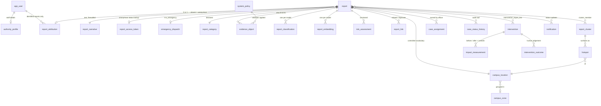

# CampusShield — Data Model & Database Schema

**Project:** Community Based Reporting and Monitoring Tool for Women's Safety in Colleges/Universities
**Database:** PostgreSQL 15+ — **no extensions required**
**Status:** Revision 10 — §§1–23 are Revision 3 as approved; §24 records the schema changes made when image evidence upload was implemented
(Phase 4B-1); §25 records the location-signal table added for the responder map
(Phase 4B-2); §26 records the first use of the ML tables (Phase 4C); §27 records
the case lifecycle — status transitions and assignment (Phase 4D); §28 records
the first writer for `notify.notification` and the one editable account field,
`identity.app_user.display_name` (Phase 4E); §29 records the campus map/location
importer and a destination-serialisation correctness fix — no schema change
(Phase 5); §30 adds `core.campus_location.is_synthetic`, distinguishing a
demo/development fixture from verified production data (Phase 5B). Revision 3's claim that "no SQL or ORM code exists yet" no longer holds: migrations `0001` and `0002`, the SQLAlchemy models, and the service layer are all built.

---

## 1. Decisions applied

| # | Decision | Effect on the schema |
|---|---|---|
| 1 | **Emergency reports may be anonymous** | The `is_emergency ⇒ identified` CHECK is **removed**. Contactability is now an explicit column on `core.report` (§6), so security learns *whether* the reporter can be reached without ever touching the identity schema. New `core.emergency_dispatch` tracks response. |
| 2 | **Evidence retention is configurable** | No hard-coded 12 months. Retention is driven by `core.system_policy`, seeded with a **prototype default** and labelled as such. Each evidence row records which policy value was applied to it. |
| 3 | **Map suppression k = 3** | Stored as a policy value, not a literal. Documented as a privacy-preserving prototype policy. |
| 4 | **No PostGIS, no pgvector** | `geog` and `vector` columns removed. Coordinates are `NUMERIC`; embeddings are `REAL[]` with a precomputed norm. §21 gives the exact additive migration path if scale later demands either. |
| 5 | **Complexity reviewed** | Three merges (§20). Every table classified CORE MVP / OPTIONAL MVP / FUTURE. **26 CORE MVP tables**, 8 OPTIONAL, 34 total. |
| 6 | **Control-location comparison retained** | Unchanged and strengthened — see `intervention.impact_measurement` (§14). |
| 7 | **Privacy separation retained** | Unchanged. The anonymous-report model is not weakened anywhere; decision 1 is implemented without introducing any identity link. |
| **E1** | **`reporter_relationship` added** | New enum and column on `core.report` (§8): `affected` / `witness` / `third_party`. **Contextual metadata only** — explicitly barred from risk scoring and from any credibility or trust computation (§8, P5, §11). |
| **E2** | **Narrative retention is configurable** | Anonymous narratives are **not** retained indefinitely. Two new `system_policy` keys govern purge, both seeded as **prototype defaults**; `core.report_narrative` gains the same retention-stamping columns as evidence (§8). |

---

## 2. Design principles

**P1 — Separation is physical, not cosmetic.**
Identity, incident, narrative, and evidence data live in **separate PostgreSQL schemas** with separate `GRANT`s. A role that can read analytics cannot read narratives; a role that can read narratives cannot resolve identity. Enforced by database privileges, not application `if` statements. This implements the deck's expected outcome: *"a privacy-by-design data architecture separating identity, incident, and evidence data."*

**P2 — Anonymity is structural.**
`core.report` **has no user column at all** — not a nullable one, not a hidden one. Attribution for identified reports lives in a separate table in the identity schema. An anonymous report is anonymous because **no attribution row was ever created**. There is nothing to leak and no UI toggle standing between a student and exposure.

**P3 — Locations are controlled vocabulary.**
Every report references `core.campus_location` by FK. No free-text place names. Hotspot detection, clustering, and impact measurement are all impossible if "Library", "library block", and "Lib" are three strings.

**P4 — Derived facts are versioned, never overwritten.**
Classifications, risk scores, and cluster memberships are append-only with an `is_current` flag. Risk *changes* as related reports arrive, and that trajectory is the evidence that early-signal detection works. It also lets baseline and transformer models score the same report side by side — what the graded comparative evaluation requires.

**P5 — The system never records guilt, and never scores a reporter.**
No accused-person table, no credibility score, no verdict column. CampusShield classifies, prioritises, and detects patterns; investigation stays with authorised institutional personnel.
This extends to `core.report.reporter_relationship` (E1): it records the reporter's **vantage point**, not their reliability. A witness account is not weaker evidence than a first-person account — it is differently situated, which matters to a responder and not at all to a scorer. The column is therefore barred from `risk_assessment.factors`, from any weighting in the classifier, and from any ranking of reports against one another.

**P6 — Policy is data, not literals.** *(new)*
Retention periods, aggregation thresholds, and similar thresholds live in `core.system_policy` and are labelled as prototype defaults where the project specification does not mandate a value. An examiner asking "why twelve months?" gets an honest answer — "that is our configurable prototype default, not a claimed institutional requirement" — instead of a magic number compiled into a migration.

---

## 3. Schema layout (the privacy boundary)

```
┌──────────────────────────────────────────────────────────────────┐
│ identity   app_user · authority_profile · report_attribution     │  ← most restricted
│            submission_quota                                       │
├──────────────────────────────────────────────────────────────────┤
│ core       system_policy · campus_zone · campus_location          │
│            report_category · report · report_narrative            │  ← narrative split out
│            report_access_token · emergency_dispatch               │
│            report_link · report_cluster · cluster_member          │
│            risk_assessment · case_assignment · case_status_history│
├──────────────────────────────────────────────────────────────────┤
│ evidence   evidence_object                                        │  ← pointers only
├──────────────────────────────────────────────────────────────────┤
│ ml         model_version · report_classification                  │
│            report_embedding · annotation · evaluation_run         │
├──────────────────────────────────────────────────────────────────┤
│ analytics  hotspot · v_public_safety_map (view)                   │  ← safe to expose
├──────────────────────────────────────────────────────────────────┤
│ intervention  intervention · intervention_report_link             │
│               impact_measurement · intervention_outcome           │
├──────────────────────────────────────────────────────────────────┤
│ notify     notification · broadcast_alert · device_token          │
├──────────────────────────────────────────────────────────────────┤
│ audit      access_log · identity_disclosure_log                   │  ← append-only
└──────────────────────────────────────────────────────────────────┘
```

### Database roles and grants

| DB role | identity | core (metadata) | core.report_narrative | evidence | ml | analytics | intervention | audit |
|---|---|---|---|---|---|---|---|---|
| `cs_app` (Flask) | RW | RW | RW | RW | RW | RW | RW | INSERT only |
| `cs_ml_worker` | — | SELECT | SELECT | — | RW | RW | — | INSERT only |
| `cs_analytics` | — | SELECT | **denied** | — | SELECT | RW | SELECT | INSERT only |
| `cs_readonly_demo` | — | SELECT | **denied** | — | SELECT | SELECT | SELECT | — |

`cs_analytics` backs the Administration dashboard. It can compute every hotspot and every impact measurement **without the ability to read a single incident narrative.** That is the most demonstrable privacy property in this design, and it exists only because narratives were split into their own table.

---

## 4. Enumerated types

```
user_role              student | security | icc | admin
report_kind            incident | concern
submission_mode        identified | anonymous
reporter_relationship  affected | witness | third_party
report_status          submitted | triaged | under_review | action_taken
                       | resolved | closed_no_action | duplicate | withdrawn
risk_band              low | moderate | high | critical
dispatch_state         pending | acknowledged | dispatched | on_scene | stood_down | closed
link_type              duplicate | related | same_pattern
link_review            unreviewed | confirmed | rejected
cluster_status         active | monitoring | dormant | resolved
hotspot_status         active | monitoring | resolved
ml_task                classification | similarity | clustering | risk_scoring
model_family           rule_based | baseline | transformer
intervention_type      lighting | patrol | cctv | access_control | signage
                       | awareness | counselling_support | policy | referral | other
intervention_scope     report | cluster | location | zone | campus
intervention_status    proposed | approved | in_progress | completed | cancelled
outcome_status         effective | partially_effective | no_change | worsened | inconclusive
notification_audience  user | role | zone | all_students
notification_category  status_update | assignment | alert | system
delivery_state         pending | sent | failed | suppressed
storage_backend        firebase_storage | local
audit_outcome          success | denied | error
policy_origin          prototype_default | institutional_requirement | regulatory
```

`policy_origin` exists because of decision 2: the schema itself distinguishes a value we chose from a value an institution mandated. Nothing in the prototype may claim the latter.

### Identifier strategy

| Kind of table | Key type | Why |
|---|---|---|
| Reports, users, evidence, interventions | `UUID` (v4, `gen_random_uuid()` from built-in `pgcrypto`) | Unguessable. An anonymous report's ID must not be enumerable or reveal submission order. |
| Lookups (categories, locations, zones) | `SMALLINT` / `INTEGER` identity | Small, stable, join-cheap. |
| Logs, history, links | `BIGINT GENERATED ALWAYS AS IDENTITY` | High volume, append-only. |

`report.public_ref` is a **random** human-quotable code (`CS-2026-7QK4M2`), never sequential — a sequence would leak total report volume and submission ordering to anyone holding two codes.

---

## 5. Configuration

### `core.system_policy` — CORE MVP *(new — decisions 2 & 3)*
**Purpose:** Runtime-configurable policy values, each labelled with its origin. Removes hard-coded retention periods and thresholds from the schema.

| Column | Type | Notes |
|---|---|---|
| `policy_key` | `TEXT` | PK — `evidence_retention_days` |
| `policy_value` | `TEXT` | NOT NULL — stored as text, cast by the app |
| `value_type` | `TEXT` | NOT NULL — integer / boolean / interval / text |
| `origin` | `policy_origin` | NOT NULL |
| `description` | `TEXT` | NOT NULL |
| `min_value` / `max_value` | `TEXT` | guard rails for admin edits |
| `updated_by` | `UUID` | FK → `identity.app_user`, nullable |
| `updated_at` | `TIMESTAMPTZ` | NOT NULL DEFAULT now() |

**PK** `policy_key` · **FK** `updated_by`
**Indexes** `INDEX(origin)`
**Constraints** `CHECK (length(description) >= 20)` — a policy without a stated rationale is not a policy.
**Privacy** No personal data. Changes are written to `audit.access_log`; retention values are exactly the sort of setting whose quiet reduction should leave a trace.

**Seeded values — all `prototype_default` unless an institution supplies otherwise:**

| key | value | origin | meaning |
|---|---|---|---|
| `evidence_retention_days` | `365` | `prototype_default` | Days after case closure before evidence is purged. **A prototype policy, not a university-mandated requirement** — the project specification defines none. |
| `evidence_retention_open_case_days` | `1095` | `prototype_default` | Ceiling for evidence on a case that never closes. |
| `narrative_retention_days` | `365` | `prototype_default` | Days after case closure before the **raw narrative** is purged. **A prototype policy, not a university-mandated requirement.** |
| `narrative_redacted_retention_days` | `730` | `prototype_default` | Days after case closure before the **redacted narrative** is purged. Set equal to the key above to purge both together. |
| `narrative_retention_open_case_days` | `1095` | `prototype_default` | Ceiling for narratives on a case that never closes. |
| `map_min_aggregation_k` | `3` | `prototype_default` | Minimum reports before a location appears on the public safety map. |
| `map_time_bucket` | `week` | `prototype_default` | Coarsest-safe time granularity for public display. |
| `anonymous_token_ttl_days` | `180` | `prototype_default` | Lifetime of an anonymous status-lookup token. |
| `emergency_callback_ttl_hours` | `24` | `prototype_default` | Lifetime of a voluntarily supplied emergency callback number. |
| `related_similarity_threshold` | `0.72` | `prototype_default` | Cosine threshold for `related`. |
| `duplicate_similarity_threshold` | `0.88` | `prototype_default` | Cosine threshold for `duplicate`. |
| `impact_window_days` | `30` | `prototype_default` | Default equal window either side of an intervention. |
| `daily_report_quota` | `5` | `prototype_default` | Anti-spam submissions per user per day. |

> **On retention (decisions 2 and E2).** The project specification defines no retention period, so the schema does not assert one. `365` is a working default chosen so the prototype has *some* defined lifecycle; it is recorded as `prototype_default`, and every evidence and narrative row stores the value that was applied to it, so changing the policy later does not silently rewrite the past. If your guide or the institution supplies a real figure, change one row and set `origin = 'institutional_requirement'` — no migration.
>
> **Why narrative retention needs two keys.** `core.report_narrative` holds two texts: the raw account and its redacted derivative. A single retention key would leave one of them governed by nothing, and since the redacted copy is the one feeding pattern analysis, "we purge narratives" would quietly not be true. Two keys make the choice explicit and configurable rather than implicit. Setting them equal purges both together, which is the conservative configuration.
>
> **One consequence to state plainly:** rows already copied into `ml.annotation.text_redacted` for model training are *not* reached by narrative purge — they have become part of the training corpus and are governed separately. That is a real retention decision, not an oversight, and it belongs in the limitations section of your report rather than being discovered by an examiner.

---

## 6. Identity schema

### `identity.app_user` — CORE MVP
**Purpose:** Who exists and what role they hold. Authentication itself is Firebase; this is the local mirror plus authorisation.

| Column | Type | Notes |
|---|---|---|
| `user_id` | `UUID` | PK, default `gen_random_uuid()` |
| `firebase_uid` | `TEXT` | UNIQUE NOT NULL — the only link to Firebase Auth |
| `role` | `user_role` | NOT NULL |
| `institutional_email` | `CITEXT` | UNIQUE NOT NULL |
| `display_name` | `TEXT` | NULL for students — see privacy note |
| `is_active` | `BOOLEAN` | NOT NULL DEFAULT true |
| `created_at` / `deactivated_at` | `TIMESTAMPTZ` | |

**PK** `user_id` · **FK** none
**Indexes** `UNIQUE(firebase_uid)`, `UNIQUE(institutional_email)`, `INDEX(role) WHERE is_active`
**Constraints** `CHECK (position('@' in institutional_email) > 1)`; `CHECK (role <> 'student' OR display_name IS NULL)` — students have no name stored.
**Privacy** Deliberately minimal. There is **no student profile table**: no course, year, hostel, phone, or photo. Nothing in the deck requires them, and a field not collected cannot be breached.
**Writable since Phase 4E** `display_name` is the one field of this row a caller may edit, via `PATCH /auth/me` — refused with 403 for `role = 'student'` in `AccountService` before the write is attempted, so the CHECK above is a backstop, not the first line of defence. No avatar or photo column exists; none was added.

### `identity.authority_profile` — OPTIONAL MVP
**Purpose:** Staff-only details for security, ICC, and administration — designation, contact, and zone jurisdiction.

| Column | Type | Notes |
|---|---|---|
| `user_id` | `UUID` | PK, FK → `identity.app_user` ON DELETE CASCADE |
| `designation` | `TEXT` | NOT NULL |
| `department` | `TEXT` | |
| `office_phone` | `TEXT` | |
| `zone_id` | `INTEGER` | FK → `core.campus_zone`, NULL = campus-wide |
| `can_receive_assignments` | `BOOLEAN` | NOT NULL DEFAULT true |
| `receives_emergency_dispatch` | `BOOLEAN` | NOT NULL DEFAULT false |

**Indexes** `INDEX(zone_id)`, `INDEX(user_id) WHERE can_receive_assignments`
**Constraints** Trigger — row may only exist where `app_user.role <> 'student'`.
**Privacy** Staff acting officially; ordinary personnel data.
**Why OPTIONAL:** MVP routing works from `app_user.role` alone. This table adds jurisdiction and dispatch preference, which are refinements. Add it when you have more than one officer per role.

### `identity.report_attribution` — CORE MVP ⭐ the anonymity mechanism
**Purpose:** The *only* place a report is ever connected to a person. A row exists **if and only if** the reporter chose to be identified.

| Column | Type | Notes |
|---|---|---|
| `report_id` | `UUID` | PK, FK → `core.report` ON DELETE CASCADE |
| `user_id` | `UUID` | FK → `identity.app_user` ON DELETE RESTRICT, NOT NULL |
| `attributed_at` | `TIMESTAMPTZ` | NOT NULL DEFAULT now() |
| `contact_consent` | `BOOLEAN` | NOT NULL DEFAULT true — may authority contact the reporter |
| `callback_contact` | `TEXT` | nullable — *(new)* voluntary phone number for emergency callback |
| `callback_expires_at` | `TIMESTAMPTZ` | nullable — auto-purge instant for the above |

**PK** `report_id` — one attribution per report, enforced by the PK itself
**FK** `report_id`, `user_id` · **Indexes** `INDEX(user_id)` (powers "my reports"), `INDEX(callback_expires_at) WHERE callback_contact IS NOT NULL` (purge job)
**Constraints**
- Trigger `trg_attribution_requires_identified` — `BEFORE INSERT OR UPDATE`, raises if the referenced `core.report.submission_mode = 'anonymous'`. An anonymous report **cannot** acquire an attribution row, by bug or by malice.
- Trigger `trg_report_mode_immutable` on `core.report` — `submission_mode` cannot change after insert. No retroactive de-anonymisation.
- `CHECK ((callback_contact IS NULL) = (callback_expires_at IS NULL))`
- `CHECK (callback_contact IS NULL OR contact_consent)` — no callback number without consent
- `ON DELETE RESTRICT` on `user_id` — deleting a user must be a conscious act, not a silent cascade through live case history.

**Privacy** Lives in the `identity` schema, readable only by `cs_app`. Every read must write to `audit.identity_disclosure_log`. Resolving *who filed this* is a logged, exceptional operation — not a join anyone can casually write.
The callback columns were added for decision 1 and belong **here**, in the identity plane, rather than on the report: they are contact data, they exist only for identified reports (guaranteed by this table's very existence), and they expire. A background job nulls them past `callback_expires_at`.

### `identity.submission_quota` — OPTIONAL MVP
**Purpose:** Abuse control for anonymous submissions **without** linking a user to their reports.

| Column | Type | Notes |
|---|---|---|
| `user_id` | `UUID` | FK → `identity.app_user` ON DELETE CASCADE |
| `quota_date` | `DATE` | NOT NULL |
| `submitted_count` | `SMALLINT` | NOT NULL DEFAULT 0 |

**PK** `(user_id, quota_date)` · **Constraints** `CHECK (submitted_count >= 0)`
**Privacy** The deliberate answer to "how do you stop anonymous spam without tracking anonymous reporters?" It stores a **counter, not a link** — how many reports a user filed today, never which ones. The rate limit works; the deanonymisation does not.

---

## 7. Core schema — locations

### `core.campus_zone` — OPTIONAL MVP
**Purpose:** Groups locations for jurisdiction, zone alerts, and control-location selection.

| Column | Type | Notes |
|---|---|---|
| `zone_id` | `INTEGER` | PK, generated identity |
| `code` | `TEXT` | UNIQUE NOT NULL |
| `name` | `TEXT` | NOT NULL |
| `description` | `TEXT` | |
| `responsible_role` | `user_role` | default authority for this zone |

**Indexes** `UNIQUE(code)`
**Why OPTIONAL:** `campus_location.zone_id` is nullable, so the MVP can run with locations alone. Zones become worthwhile once you have zone-scoped alerts or more than one security officer.

### `core.campus_location` — CORE MVP ⭐ the controlled vocabulary
**Purpose:** The fixed, curated list of campus places. Every report, hotspot, and intervention anchors here.

| Column | Type | Notes |
|---|---|---|
| `location_id` | `INTEGER` | PK, generated identity |
| `code` | `TEXT` | UNIQUE NOT NULL — `LIB-BLK`, `PARK-B`, `GATE-N` |
| `name` | `TEXT` | NOT NULL — "Library Block, rear entrance" |
| `zone_id` | `INTEGER` | FK → `core.campus_zone`, **nullable** |
| `location_type` | `TEXT` | academic / hostel / gate / path / parking / open_ground / transit / other |
| `latitude` | `NUMERIC(9,6)` | NOT NULL |
| `longitude` | `NUMERIC(9,6)` | NOT NULL |
| `is_indoor` | `BOOLEAN` | |
| `has_lighting` | `BOOLEAN` | environmental baseline — flips when a lighting intervention completes |
| `has_cctv` | `BOOLEAN` | environmental baseline |
| `footfall_band` | `TEXT` | high / medium / low — risk-scoring input |
| `dispatch_note` | `TEXT` | *(new)* fixed access guidance for responders — "enter via service gate" |
| `is_active` | `BOOLEAN` | NOT NULL DEFAULT true — retire locations, never delete |

**PK** `location_id` · **FK** `zone_id`
**Indexes** `UNIQUE(code)`, `INDEX(zone_id)`, `INDEX(location_type)`, `INDEX(is_active)`
**Constraints** `CHECK (latitude BETWEEN -90 AND 90)`, `CHECK (longitude BETWEEN -180 AND 180)`
**Privacy** Public reference data. Safe to ship to the client for map rendering.

> **Decision 4 applied.** The PostGIS `geog` column is gone. `latitude`/`longitude` are the source of truth and all distance work happens in Python (Haversine over ~50 fixed points on a campus a few hundred metres across — microseconds). `dispatch_note` was added for decision 1: an anonymous emergency gives security a place and nothing else, so the place has to carry its own access instructions.

### `core.report_category` — CORE MVP
**Purpose:** The taxonomy the student picks from and the classifier predicts into. Also drives **routing** — this is where Objective 2 (role-based case management) is actually implemented.

| Column | Type | Notes |
|---|---|---|
| `category_id` | `SMALLINT` | PK, generated identity |
| `code` | `TEXT` | UNIQUE — `HARASS_VERBAL`, `STALKING`, `LIGHTING_POOR`, `ISOLATED_PATH` |
| `label` | `TEXT` | NOT NULL |
| `kind` | `report_kind` | NOT NULL — incident vs. environmental concern |
| `routes_to_role` | `user_role` | NOT NULL — harassment → `icc`, lighting → `security` |
| `base_severity` | `SMALLINT` | 1–5, risk-scoring input |
| `requires_confidentiality` | `BOOLEAN` | if true, narrative is ICC-only |
| `emergency_eligible` | `BOOLEAN` | *(new)* may this category be raised in emergency mode |
| `is_active` | `BOOLEAN` | |

**Indexes** `UNIQUE(code)`, `INDEX(kind, is_active)`, `INDEX(routes_to_role)`
**Constraints** `CHECK (base_severity BETWEEN 1 AND 5)`, `CHECK (routes_to_role <> 'student')`, `CHECK (NOT emergency_eligible OR kind = 'incident')` — a broken streetlight is not an emergency.

---

## 8. Core schema — reports

### `core.report` — CORE MVP ⭐ the central table
**Purpose:** One submitted report — incident or environmental concern. Metadata and derived state only. **No reporter reference, no narrative text.**

| Column | Type | Notes |
|---|---|---|
| `report_id` | `UUID` | PK, default `gen_random_uuid()` |
| `public_ref` | `TEXT` | UNIQUE NOT NULL — random `CS-2026-7QK4M2` |
| `report_kind` | `report_kind` | NOT NULL |
| `submission_mode` | `submission_mode` | NOT NULL — **immutable after insert** |
| `reporter_relationship` | `reporter_relationship` | *(E1)* NOT NULL DEFAULT `affected` — vantage point, **never credibility** |
| `declared_category_id` | `SMALLINT` | FK → `core.report_category` — what the *student* chose |
| `location_id` | `INTEGER` | FK → `core.campus_location` NOT NULL |
| `location_hint` | `TEXT` | optional detail — "near the rear stairwell". Free text, but **not the location itself** |
| `occurred_at` | `TIMESTAMPTZ` | NOT NULL |
| `occurred_hour` | `SMALLINT` | 0–23, campus-local, set by the app on insert |
| `occurred_dow` | `SMALLINT` | 0–6, campus-local, set by the app on insert |
| `submitted_at` | `TIMESTAMPTZ` | NOT NULL DEFAULT now() |
| `is_emergency` | `BOOLEAN` | NOT NULL DEFAULT false |
| `is_ongoing` | `BOOLEAN` | *(new)* NOT NULL DEFAULT false — happening now, dispatch-relevant |
| **`reporter_contactable`** | `BOOLEAN` | *(new)* NOT NULL DEFAULT false — **see below** |
| `current_status` | `report_status` | NOT NULL DEFAULT `submitted` — denormalised, trigger-maintained |
| `current_risk_score` | `NUMERIC(5,2)` | denormalised from latest `risk_assessment` |
| `current_risk_band` | `risk_band` | denormalised |
| `current_cluster_id` | `UUID` | FK → `core.report_cluster`, nullable |
| `source_language` | `TEXT` | default `en` |
| `closed_at` | `TIMESTAMPTZ` | |

**PK** `report_id`
**FK** `declared_category_id`, `location_id`, `current_cluster_id`
**Indexes**
`UNIQUE(public_ref)` · `INDEX(location_id, occurred_at DESC)` (hotspots) · `INDEX(current_status, current_risk_score DESC)` (triage queue) · `INDEX(submitted_at DESC)` · `INDEX(current_cluster_id) WHERE current_cluster_id IS NOT NULL` · `INDEX(occurred_hour)` · `INDEX(location_id, submitted_at)` (impact measurement) · `INDEX(submitted_at DESC) WHERE is_emergency AND current_status = 'submitted'` (live dispatch queue)

**Constraints**
- `CHECK (occurred_at <= submitted_at)` — cannot report the future
- `CHECK (occurred_hour BETWEEN 0 AND 23)`, `CHECK (occurred_dow BETWEEN 0 AND 6)`
- **`CHECK (submission_mode = 'identified' OR reporter_contactable = false)`** — anonymous implies not contactable, structurally
- `CHECK (NOT is_ongoing OR is_emergency)` — "happening now" only makes sense in emergency mode
- ~~`CHECK (NOT is_emergency OR submission_mode = 'identified')`~~ — **removed per decision 1**
- Triggers: `submission_mode` and `report_kind` immutable after insert

**Privacy** Readable by every authority role. Contains nothing identifying the reporter and no narrative.

> ### `reporter_contactable` — how decision 1 is represented
>
> Allowing anonymous emergencies creates one operational question security must answer in seconds: *can I call this person, or do I dispatch blind to a location?*
>
> The naive implementations both fail. Joining to `identity.report_attribution` would put the identity schema inside the emergency path — the exact coupling P1 forbids. Leaving security to infer it from `submission_mode` invites the wrong guess under pressure.
>
> So contactability is a **plain boolean in the incident plane** that answers the operational question **without revealing, or requiring access to, any identity**:
>
> | | `submission_mode` | `reporter_contactable` | What security sees |
> |---|---|---|---|
> | Anonymous emergency | `anonymous` | `false` — enforced by CHECK | *"Reporter not contactable. Dispatch to location."* |
> | Identified, consent given | `identified` | `true` | *"Reporter contactable via case channel."* |
> | Identified, consent withheld | `identified` | `false` | *"Reporter has declined contact."* |
>
> `false` is the default and the CHECK makes it the only legal value for anonymous reports, so the failure mode of any bug is *"we couldn't contact them"* — never *"we exposed someone who asked not to be."* A trigger keeps the column in step with `report_attribution.contact_consent`.
>
> An anonymous emergency therefore carries everything dispatch needs — `location_id` (with `dispatch_note`), `location_hint`, `declared_category_id`, `occurred_at`, `is_ongoing`, `reporter_relationship` — and nothing about the person. The reporter still gets one-way visibility of the response by returning with their access token; the system cannot push to them, and that limitation is real, permanent, and must be stated in the UI at submission time rather than papered over.

> ### `reporter_relationship` — contextual metadata only (E1)
>
> Records the reporter's **vantage point**: `affected` (this happened to me), `witness` (I saw it happen), `third_party` (someone told me, or I am reporting on their behalf).
>
> **What it is for.** Operational context. A responder handles *"a witness reports an assault in progress at the north gate"* differently from *"a student reports being followed here last Tuesday"* — not because one is more believable, but because the first has a bystander on scene who may still be there and the second does not. It also makes duplicate detection more honest: three `witness` reports of one event are three views of a single incident, not three incidents, and treating them as three would inflate every hotspot and every recurrence count downstream.
>
> **What it must never be used for — enforced by convention and documented at every point of use:**
>
> | Prohibited | Why |
> |---|---|
> | A credibility, trust, or reliability score | A witness account is not weaker evidence than a first-person one. It is differently situated. |
> | Any term or weight in `risk_assessment.factors` | Risk scores situations, not reporters (P5). The column is absent from the factors schema in §11 and must stay absent. |
> | Any weighting, feature, or filter in classification or similarity | Models see the narrative and the category, never who was standing where. |
> | Ordering or de-prioritising the triage queue | Queue order comes from `current_risk_score` alone. |
> | Any UI treatment implying a report is less serious | No greyed-out rows, no "unverified" badge, no secondary tab. |
>
> **Design consequences.** `affected` is the default, so a reporter who skips the question is never sorted into a lesser tier. There is deliberately **no index** on the column — an index exists to make something a query dimension, and this must not become one for ranking. It carries no identity risk for anonymous reports: `third_party` narrows nothing about who filed.
>
> The reason to state the prohibition in the schema documentation rather than only in code review is that this is precisely the column a future contributor will reach for when asked to "reduce false positives." That instinct is how a safety tool acquires a credibility score without anyone deciding to build one.

### `core.report_narrative` — CORE MVP ⭐ the narrative firewall
**Purpose:** The student's free-text account, isolated so read access can be revoked independently of everything else.

| Column | Type | Notes |
|---|---|---|
| `report_id` | `UUID` | PK, FK → `core.report` ON DELETE CASCADE |
| `narrative` | `TEXT` | **nullable** — the raw account; NULL once purged |
| `narrative_redacted` | `TEXT` | nullable — PII-scrubbed version for ML and analyst preview |
| `redaction_state` | `TEXT` | pending / auto_redacted / human_reviewed |
| `redacted_at` | `TIMESTAMPTZ` | |
| `word_count` | `INTEGER` | survives purge — preserves corpus statistics without the text |
| `retention_policy_key` | `TEXT` | *(E2)* FK → `core.system_policy`, NOT NULL |
| `narrative_retention_days_applied` | `INTEGER` | *(E2)* NOT NULL — value in force at submission |
| `redacted_retention_days_applied` | `INTEGER` | *(E2)* NOT NULL |
| `narrative_expires_at` | `TIMESTAMPTZ` | *(E2)* nullable until the case closes |
| `redacted_expires_at` | `TIMESTAMPTZ` | *(E2)* nullable until the case closes |
| `narrative_purged_at` | `TIMESTAMPTZ` | *(E2)* set when the raw text is destroyed |
| `redacted_purged_at` | `TIMESTAMPTZ` | *(E2)* set when the redacted text is destroyed |
| `purge_reason` | `TEXT` | *(E2)* retention_expiry / withdrawn / admin_request |

**PK** `report_id` · **FK** `report_id`, `retention_policy_key`
**Indexes** `GIN (to_tsvector('english', narrative_redacted))` — search operates on the **redacted** text only · `INDEX(narrative_expires_at) WHERE narrative_purged_at IS NULL` · `INDEX(redacted_expires_at) WHERE redacted_purged_at IS NULL` (both drive the purge job)
**Constraints**
- `CHECK (narrative IS NULL OR length(narrative) BETWEEN 10 AND 8000)`
- `CHECK ((narrative IS NULL AND narrative_purged_at IS NOT NULL) OR (narrative IS NOT NULL AND narrative_purged_at IS NULL))` — a NULL narrative must be an *explained* NULL, never an accident
- the same pairing for `narrative_redacted` / `redacted_purged_at`
- `CHECK (narrative_retention_days_applied > 0 AND redacted_retention_days_applied > 0)`

**Privacy** The highest-sensitivity table in `core`. `cs_analytics` is denied `SELECT` outright. Categories with `requires_confidentiality = true` are further restricted to ICC via RLS. Full-text search indexes only the redacted column, so a search feature cannot become an exfiltration channel for un-redacted text.

> ### Decision E2 — narratives are not retained indefinitely
>
> **Anonymous narratives now expire.** Retention is configurable through `core.system_policy` on the same pattern as evidence: the policy in force at submission is stamped onto the row, so amending the policy later governs new reports without retroactively changing the terms under which existing accounts were given.
>
> The purge **nulls the text and keeps the row.** Deleting the row would take the report's status history, its cluster membership, and its contribution to every hotspot and impact measurement with it — destroying the longitudinal record that is the entire point of the system. What survives a purge is metadata that was never sensitive: `report_id`, `word_count`, timestamps, and the purge audit fields. What is destroyed is the account itself.
>
> This matters most for anonymous reports, which is what makes it worth doing. An anonymous narrative can never be deleted on request — nobody can prove ownership of it beyond holding a token — so a scheduled, policy-driven expiry is the *only* mechanism by which it will ever stop existing. Indefinite retention would have meant a student's account of what happened to them living in the database permanently, with no person on earth able to ask for it back.
>
> Both `narrative_purged_at` and `redacted_purged_at` are timestamps rather than booleans so that "when did this stop existing?" has an answer, and every purge run writes to `audit.access_log` with `action = 'narrative.purge'`.

### `core.report_access_token` — CORE MVP
**Purpose:** Lets an **anonymous** reporter check their own report's status without an account and without any stored link to them. With decision 1, this is also the only channel an anonymous emergency reporter has for following the response.

| Column | Type | Notes |
|---|---|---|
| `token_hash` | `TEXT` | PK — SHA-256 of a 128-bit random token |
| `report_id` | `UUID` | FK → `core.report` ON DELETE CASCADE, UNIQUE |
| `issued_at` | `TIMESTAMPTZ` | NOT NULL |
| `expires_at` | `TIMESTAMPTZ` | from `anonymous_token_ttl_days` |
| `last_used_at` | `TIMESTAMPTZ` | |
| `use_count` | `INTEGER` | NOT NULL DEFAULT 0 |
| `revoked_at` | `TIMESTAMPTZ` | |

**Indexes** `UNIQUE(report_id)`, `INDEX(expires_at) WHERE revoked_at IS NULL`
**Privacy** The raw token is shown once at submission and **never stored**. A database dump yields only hashes. 128-bit randomness makes lookup infeasible; the endpoint should still be rate-limited.

### `core.emergency_dispatch` — OPTIONAL MVP *(new — decision 1)*
**Purpose:** Tracks the security response to an emergency report. Separate from `case_status_history` because dispatch runs on minutes while case handling runs on days, and the two must not be conflated.

| Column | Type | Notes |
|---|---|---|
| `dispatch_id` | `UUID` | PK |
| `report_id` | `UUID` | FK → `core.report` ON DELETE CASCADE, UNIQUE |
| `state` | `dispatch_state` | NOT NULL DEFAULT `pending` |
| `raised_at` | `TIMESTAMPTZ` | NOT NULL — copied from `report.submitted_at` |
| `acknowledged_at` | `TIMESTAMPTZ` | |
| `acknowledged_by` | `UUID` | FK → `identity.app_user` |
| `dispatched_at` / `on_scene_at` / `closed_at` | `TIMESTAMPTZ` | |
| `responder_note` | `TEXT` | internal |
| `public_note` | `TEXT` | *safe* text shown to the reporter via their token |
| `contact_attempted` | `BOOLEAN` | NOT NULL DEFAULT false |
| `outcome_summary` | `TEXT` | |

**Indexes** `UNIQUE(report_id)`, `INDEX(state) WHERE state <> 'closed'`, `INDEX(raised_at DESC)`
**Constraints**
- `CHECK (acknowledged_at IS NULL OR acknowledged_at >= raised_at)`, and the same monotonic chain through `closed_at`
- Trigger — a row may only exist for a report with `is_emergency = true`
- Trigger — `contact_attempted` may only be set true where `report.reporter_contactable = true`. **The database refuses to record a contact attempt against a reporter the system promised it could not contact.**

**Privacy** No identity. `public_note` is the one field an anonymous reporter can read back through their token, which is why it is separated from `responder_note` at the schema level rather than by a UI filter.
**Why OPTIONAL:** the *representation* of anonymous emergency dispatch — decision 1's actual requirement — lives in `core.report.reporter_contactable` and `is_ongoing`, both CORE. This table tracks the response lifecycle, which is valuable but not required by the mandatory workflow.

---

## 9. Evidence schema

### `evidence.evidence_object` — CORE MVP
**Purpose:** A **pointer** to a file in Firebase Cloud Storage. The database never holds file bytes.

| Column | Type | Notes |
|---|---|---|
| `evidence_id` | `UUID` | PK |
| `report_id` | `UUID` | FK → `core.report` ON DELETE CASCADE NOT NULL |
| `storage_backend` | `storage_backend` | NOT NULL |
| `storage_path` | `TEXT` | NOT NULL — opaque bucket path, never a public URL |
| `content_type` | `TEXT` | NOT NULL |
| `byte_size` | `BIGINT` | NOT NULL |
| `sha256` | `TEXT` | integrity + duplicate detection |
| `original_filename` | `TEXT` | **Always NULL as of Revision 4** — see §24 |
| `uploaded_at` | `TIMESTAMPTZ` | NOT NULL |
| `retention_policy_key` | `TEXT` | *(new)* FK → `core.system_policy`, NOT NULL |
| `retention_days_applied` | `INTEGER` | *(new)* NOT NULL — the value in force at upload |
| `retention_expires_at` | `TIMESTAMPTZ` | nullable until the case closes |
| `is_purged` | `BOOLEAN` | NOT NULL DEFAULT false |
| `purged_at` | `TIMESTAMPTZ` | |
| `purge_reason` | `TEXT` | retention_expiry / withdrawn / admin_request |

**PK** `evidence_id` · **FK** `report_id`, `retention_policy_key`
**Indexes** `INDEX(report_id)`, `INDEX(sha256)`, `INDEX(retention_expires_at) WHERE NOT is_purged`, `INDEX(is_purged)`
**Constraints** `CHECK (byte_size > 0 AND byte_size <= 26214400)` (25 MB); `CHECK (NOT is_purged OR purged_at IS NOT NULL)`; `CHECK (retention_days_applied > 0)`
**Privacy**
- **No uploader column.** An uploader FK would silently de-anonymise every anonymous report that carried a photo — the exact failure P2 exists to prevent.
- ~~`original_filename` is dropped for anonymous submissions.~~ **Revised in Revision 4:** it is dropped for *every* report. Phone filenames leak more than people expect (`IMG_20260810_Priya_hostel.jpg`), and the upload endpoint cannot know which kind of report an image will end up on. See §24.
- ~~Files are served only through short-lived signed URLs minted by Flask after an authorisation check.~~ **Revised in Revision 4:** bytes are *streamed* through Flask instead. A signed URL outlives its authorisation check for the length of its TTL and can be forwarded to anyone; a stream cannot. `storage_path` never reaches the client either way.
- ~~The client strips EXIF (GPS, device serial) before upload; the server re-strips on receipt.~~ **Corrected in Revision 4:** the client strips **nothing**. It has no such capability and never did — writing it here described an intention, not a mechanism. The server is the only thing that removes metadata, which is the correct place for it: a client-side strip is unverifiable and a client that skips it is indistinguishable from one that cannot.

> **Decision 2 applied.** Retention is no longer a hard-coded 12 months. `retention_days_applied` snapshots the policy in force at upload, so amending `system_policy` later governs new evidence without silently rewriting the terms under which existing evidence was collected. `retention_expires_at` is computed as `closed_at + retention_days_applied` when the case closes, and falls back to `evidence_retention_open_case_days` for cases that never do.

*(`evidence.evidence_access_log` has been merged into `audit.access_log` — see §20.)*

---

## 10. ML schema

### `ml.model_version` — CORE MVP
**Purpose:** Registry of every model that has produced an inference. **Directly serves the graded comparative evaluation** — this is what lets baseline and transformer results coexist and be compared.

| Column | Type | Notes |
|---|---|---|
| `model_id` | `UUID` | PK |
| `name` | `TEXT` | NOT NULL — `tfidf-linsvc`, `distilbert-incident-clf` |
| `task` | `ml_task` | NOT NULL |
| `family` | `model_family` | NOT NULL |
| `version` | `TEXT` | NOT NULL |
| `artifact_uri` | `TEXT` | path to the saved model |
| `embedding_dim` | `SMALLINT` | nullable — set for similarity models |
| `trained_at` | `TIMESTAMPTZ` | |
| `training_rows` | `INTEGER` | |
| `hyperparameters` | `JSONB` | |
| `headline_metrics` | `JSONB` | `{"accuracy":0.87,"macro_f1":0.83}` |
| `is_active` | `BOOLEAN` | the model currently serving production inference |

**Indexes** `UNIQUE(name, version)`, `UNIQUE(task) WHERE is_active` — **exactly one active model per task**, enforced by a partial unique index rather than application discipline.

### `ml.report_classification` — CORE MVP
**Purpose:** One model's prediction for one report. Multiple rows per report is the normal case — that is what makes comparison on live data possible.

| Column | Type | Notes |
|---|---|---|
| `classification_id` | `BIGINT` | PK identity |
| `report_id` | `UUID` | FK → `core.report` ON DELETE CASCADE |
| `model_id` | `UUID` | FK → `ml.model_version` |
| `predicted_category_id` | `SMALLINT` | FK → `core.report_category` |
| `confidence` | `NUMERIC(5,4)` | 0–1 |
| `label_scores` | `JSONB` | full distribution over categories |
| `inferred_at` | `TIMESTAMPTZ` | NOT NULL DEFAULT now() |
| `latency_ms` | `INTEGER` | baseline-vs-transformer cost comparison |
| `is_current` | `BOOLEAN` | the prediction shown in the UI |
| `overridden_by` | `UUID` | FK → `identity.app_user`, nullable |
| `overridden_category_id` | `SMALLINT` | FK → `core.report_category`, nullable |
| `overridden_at` | `TIMESTAMPTZ` | nullable |

**Indexes** `UNIQUE(report_id) WHERE is_current` · `INDEX(report_id, model_id)` · `INDEX(model_id, inferred_at DESC)` · `INDEX(predicted_category_id)` · `INDEX(overridden_at) WHERE overridden_by IS NOT NULL`
**Constraints** `CHECK (confidence BETWEEN 0 AND 1)`; `CHECK ((overridden_by IS NULL) = (overridden_category_id IS NULL))`
**Privacy** Stores no narrative — only the category outcome. **The override columns are quietly one of the most valuable things in this schema:** each correction is a free human-labelled training example, and the override rate is a defensible accuracy metric measured on your own campus data rather than on a borrowed dataset.

### `ml.report_embedding` — CORE MVP
**Purpose:** Vector representation of the redacted narrative, powering related/duplicate detection.

| Column | Type | Notes |
|---|---|---|
| `report_id` | `UUID` | PK part, FK → `core.report` ON DELETE CASCADE |
| `model_id` | `UUID` | PK part, FK → `ml.model_version` |
| `embedding` | `REAL[]` | NOT NULL — **plain array, no pgvector** |
| `dim` | `SMALLINT` | NOT NULL — guards against dimension mismatch |
| `l2_norm` | `REAL` | NOT NULL — precomputed, so cosine is a dot product over two lookups |
| `computed_at` | `TIMESTAMPTZ` | NOT NULL |

**PK** `(report_id, model_id)` · **Indexes** `INDEX(model_id)`, `INDEX(computed_at DESC)`
**Constraints** `CHECK (dim = array_length(embedding, 1))`, `CHECK (l2_norm > 0)`
**Privacy** Embeddings are derived from the **redacted** narrative. This matters: text embeddings are partially invertible, so embedding raw narratives would smuggle un-redacted content past the narrative firewall.

> **Decision 4 applied.** `REAL[]` rather than `vector(384)`. Similarity is computed in NumPy: load embeddings for the candidate window (same location or ±30 days), one matrix multiply, threshold from `system_policy`. At hundreds of reports this is sub-millisecond and needs no extension. `l2_norm` is stored so cosine never recomputes norms. §21 gives the migration to pgvector if the corpus ever reaches the scale where an ANN index earns its keep.

### `ml.annotation` — CORE MVP
**Purpose:** Gold labels for training and evaluation — from imported corpora and from authority overrides.

| Column | Type | Notes |
|---|---|---|
| `annotation_id` | `BIGINT` | PK identity |
| `source` | `TEXT` | NOT NULL — `external_corpus` / `authority_override` / `manual_seed` / `synthetic` |
| `external_ref` | `TEXT` | id within an imported dataset |
| `report_id` | `UUID` | FK → `core.report`, NULL for external corpus rows |
| `text_redacted` | `TEXT` | the training text |
| `gold_category_id` | `SMALLINT` | FK → `core.report_category` |
| `split` | `TEXT` | train / val / test |
| `annotated_by` | `UUID` | FK → `identity.app_user`, nullable |
| `annotated_at` | `TIMESTAMPTZ` | |

**Indexes** `INDEX(split)`, `INDEX(gold_category_id)`, `INDEX(source)`, `UNIQUE(source, external_ref)`
**Constraints** `CHECK (report_id IS NOT NULL OR text_redacted IS NOT NULL)`
**Privacy** Training data draws from redacted text only. Rows sourced from real campus reports must never be exported off-system.

### `ml.evaluation_run` — CORE MVP
**Purpose:** **This table is the deliverable.** Expected Outcome 2 asks for a comparative evaluation of baseline vs. transformer with accuracy/F1 — the numbers live here reproducibly, not in a screenshot of a notebook.

| Column | Type | Notes |
|---|---|---|
| `run_id` | `UUID` | PK |
| `model_id` | `UUID` | FK → `ml.model_version` |
| `dataset_label` | `TEXT` | NOT NULL |
| `split` | `TEXT` | usually `test` |
| `n_samples` | `INTEGER` | |
| `accuracy` | `NUMERIC(5,4)` | |
| `macro_f1` | `NUMERIC(5,4)` | |
| `weighted_f1` | `NUMERIC(5,4)` | |
| `precision_macro` / `recall_macro` | `NUMERIC(5,4)` | |
| `per_class_metrics` | `JSONB` | |
| `confusion_matrix` | `JSONB` | |
| `mean_latency_ms` | `INTEGER` | accuracy is not the only axis of comparison |
| `run_at` | `TIMESTAMPTZ` | |
| `notes` | `TEXT` | |

**Indexes** `INDEX(model_id, run_at DESC)`, `INDEX(dataset_label, split)`
**Constraints** all metric columns `CHECK (... BETWEEN 0 AND 1)`, `CHECK (n_samples > 0)`

---

## 11. Risk prioritisation

### `core.risk_assessment` — CORE MVP
**Purpose:** Versioned risk score for a report. Append-only, because risk **rises** when related reports arrive — and that trajectory is the evidence for the project's central claim about early signal detection.

| Column | Type | Notes |
|---|---|---|
| `assessment_id` | `BIGINT` | PK identity |
| `report_id` | `UUID` | FK → `core.report` ON DELETE CASCADE |
| `score` | `NUMERIC(5,2)` | 0–100 |
| `band` | `risk_band` | NOT NULL |
| `scorer_version` | `TEXT` | NOT NULL — rule version or model version |
| `model_id` | `UUID` | FK → `ml.model_version`, nullable |
| `factors` | `JSONB` | NOT NULL — **the explanation** |
| `computed_at` | `TIMESTAMPTZ` | NOT NULL DEFAULT now() |
| `is_current` | `BOOLEAN` | NOT NULL |
| `trigger_reason` | `TEXT` | `initial` / `new_related_report` / `cluster_growth` / `manual_review` |

**Indexes** `UNIQUE(report_id) WHERE is_current` · `INDEX(report_id, computed_at DESC)` · `INDEX(band, computed_at DESC)`
**Constraints** `CHECK (score BETWEEN 0 AND 100)`

**`factors` shape** — required, not optional:
```json
{ "category_severity": 4, "recurrence_at_location_90d": 6, "cluster_size": 3,
  "is_emergency": false, "is_ongoing": false, "night_hours": true,
  "location_lighting": false,
  "weights": {"severity":0.3,"recurrence":0.35,"cluster":0.2,"environment":0.15} }
```
**Privacy / ethics** Per P5 this scores **situations, not people**. No reporter attribute, no accused party, no credibility term enters the computation. Storing `factors` makes every prioritisation explainable to a student, an examiner, or an ICC member — which is what "decision-support, not autonomous decision-maker" requires in practice.

> **`reporter_relationship` is absent from `factors` by design (E1)** and must stay absent. It is the one field in `core.report` that looks like a plausible scoring input and is prohibited from being one — a scorer that discounts `witness` reports has built a credibility model, whatever it is called in the code. Note that `is_emergency` and `is_ongoing` *are* legitimate factors: they describe the situation's urgency, not the reporter's standing.

---

## 12. Related reports and clusters

### `core.report_link` — CORE MVP
**Purpose:** A pairwise relationship between two reports — duplicate, related, or same behavioural pattern.

| Column | Type | Notes |
|---|---|---|
| `link_id` | `BIGINT` | PK identity |
| `report_id_a` | `UUID` | FK → `core.report` ON DELETE CASCADE |
| `report_id_b` | `UUID` | FK → `core.report` ON DELETE CASCADE |
| `link_type` | `link_type` | NOT NULL |
| `similarity` | `NUMERIC(5,4)` | cosine similarity |
| `method` | `TEXT` | `embedding_cosine` / `location_time_proximity` / `manual` |
| `model_id` | `UUID` | FK → `ml.model_version`, nullable |
| `detected_at` | `TIMESTAMPTZ` | |
| `review_state` | `link_review` | NOT NULL DEFAULT `unreviewed` |
| `reviewed_by` | `UUID` | FK → `identity.app_user`, nullable |

**Indexes** `UNIQUE(report_id_a, report_id_b, link_type)` · `INDEX(report_id_a)` · `INDEX(report_id_b)` · `INDEX(review_state) WHERE review_state = 'unreviewed'`
**Constraints**
- `CHECK (report_id_a < report_id_b)` — **canonical ordering.** Storing each pair in exactly one direction is what makes the UNIQUE constraint actually prevent duplicates; without it, (A,B) and (B,A) both insert and deduplication silently stops working.
- `CHECK (report_id_a <> report_id_b)`
- `CHECK (similarity IS NULL OR similarity BETWEEN 0 AND 1)`

**Privacy** Links two reports, never two people. State the limitation plainly in your report: linking two anonymous reports does **not** imply the same reporter, and the UI must not suggest it does.

### `core.report_cluster` — CORE MVP
**Purpose:** A named group of related reports — a pattern the authority acts on as one unit.

| Column | Type | Notes |
|---|---|---|
| `cluster_id` | `UUID` | PK |
| `label` | `TEXT` | generated — "Evening incidents, Parking Block B" |
| `primary_location_id` | `INTEGER` | FK → `core.campus_location` |
| `zone_id` | `INTEGER` | FK → `core.campus_zone`, nullable |
| `dominant_category_id` | `SMALLINT` | FK → `core.report_category` |
| `centroid_lat` / `centroid_lng` | `NUMERIC(9,6)` | computed in Python |
| `modal_hour_start` / `modal_hour_end` | `SMALLINT` | the recurring time band |
| `first_report_at` / `last_report_at` | `TIMESTAMPTZ` | |
| `report_count` | `INTEGER` | maintained by trigger |
| `cluster_risk_score` | `NUMERIC(5,2)` | |
| `status` | `cluster_status` | NOT NULL DEFAULT `active` |
| `algorithm` | `TEXT` | `dbscan` / `manual` |
| `algorithm_params` | `JSONB` | eps, min_samples — reproducibility |
| `detection_run_id` | `UUID` | *(new)* correlation id, plain UUID, no FK — see §20 |
| `created_at` | `TIMESTAMPTZ` | |

**Indexes** `INDEX(primary_location_id)`, `INDEX(status, cluster_risk_score DESC)`, `INDEX(last_report_at DESC)`, `INDEX(detection_run_id)`

### `core.cluster_member` — CORE MVP
**Purpose:** Many-to-many between clusters and reports.

| Column | Type | Notes |
|---|---|---|
| `cluster_id` | `UUID` | PK part, FK → `core.report_cluster` ON DELETE CASCADE |
| `report_id` | `UUID` | PK part, FK → `core.report` ON DELETE CASCADE |
| `membership_score` | `NUMERIC(5,4)` | |
| `added_at` | `TIMESTAMPTZ` | |
| `detection_run_id` | `UUID` | correlation id, no FK |

**PK** `(cluster_id, report_id)` · **Indexes** `INDEX(report_id)`
**Note** `core.report.current_cluster_id` is a denormalised convenience pointer for the common single-cluster case; this table remains the source of truth.

---

## 13. Analytics — hotspots

### `analytics.hotspot` — CORE MVP
**Purpose:** A location–time window flagged as elevated risk. The heatmap and the Administration dashboard read from here.

| Column | Type | Notes |
|---|---|---|
| `hotspot_id` | `UUID` | PK |
| `location_id` | `INTEGER` | FK → `core.campus_location` NOT NULL |
| `zone_id` | `INTEGER` | FK → `core.campus_zone`, nullable |
| `cluster_id` | `UUID` | FK → `core.report_cluster`, nullable |
| `window_start` / `window_end` | `TIMESTAMPTZ` | NOT NULL |
| `report_count` | `INTEGER` | NOT NULL |
| `density_score` | `NUMERIC(6,3)` | reports per week, normalised |
| `dominant_hour_band` | `TEXT` | |
| `severity_band` | `risk_band` | |
| `status` | `hotspot_status` | NOT NULL DEFAULT `active` |
| `detection_run_id` | `UUID` | *(new)* correlation id, no FK |
| `detection_algorithm` | `TEXT` | *(new)* `dbscan` / `grid_density` |
| `detection_params` | `JSONB` | *(new)* `{"eps_metres":40,"min_samples":3,"window_days":30}` |
| `detected_at` | `TIMESTAMPTZ` | NOT NULL |
| `resolved_at` | `TIMESTAMPTZ` | set when an intervention demonstrably works |

**PK** `hotspot_id` · **FK** `location_id`, `zone_id`, `cluster_id`
**Indexes** `INDEX(location_id, window_end DESC)`, `INDEX(status, severity_band)`, `INDEX(detection_run_id)`, `INDEX(detected_at DESC)`
**Constraints** `CHECK (window_start < window_end)`, `CHECK (report_count >= 0)`, `CHECK (status <> 'resolved' OR resolved_at IS NOT NULL)`
**Privacy** Aggregate only. Safe to expose to all students *through the view below*, not directly.

> The former `analytics.hotspot_detection_run` table was merged into these three columns — see §20.

### `analytics.v_public_safety_map` (view) — CORE MVP
**Purpose:** The **only** report-derived object the student community may query.

**Exposes:** `location_id`, `location_name`, `latitude`, `longitude`, `week_bucket`, `report_kind`, `report_count`, `severity_band`
**Excludes:** every identifier, all narrative, timestamp precision below one week, specific category, and every report that fails the threshold below.
**Guard:** `HAVING count(*) >= (map_min_aggregation_k from core.system_policy)`

> ### Decision 3 — k = 3 as a privacy-preserving prototype policy
>
> **k = 3 is retained as the default minimum aggregation threshold.** It is a *prototype privacy policy*, recorded in `core.system_policy` with `origin = 'prototype_default'`, not a claimed institutional or regulatory requirement.
>
> The rationale: below the threshold, an aggregate stops being an aggregate. "1 incident report — Hostel Block C — Tuesday evening" is not statistics; to anyone who was near Hostel Block C on Tuesday evening it can identify both the incident and the person who reported it. A community safety map that discloses that has inverted its own purpose, and a student who works this out once will never file again.
>
> **The rule: individual and low-count reports are never exposed through the public or community safety map.** Concretely —
> - Locations with fewer than `k` reports in a bucket are **omitted entirely**, not shown as zero and not shown as "<3". A suppressed cell that announces its own suppression still confirms that *something* happened there.
> - Time is bucketed to the week; exact timestamps never reach the public layer.
> - No category detail — a public map showing "harassment" versus "poor lighting" at a thinly-populated location re-identifies by another route.
> - Authority dashboards read `analytics.hotspot` and `core.report` directly and are **not** subject to k; suppression protects students from the public, not case-handlers from their own casework.
> - `k` is configurable, and lowering it is an auditable act — a smaller value makes the demo map livelier and the guarantee weaker. 3 is the smallest value that still prevents single-report disclosure.

---

## 14. Case management

### `core.case_assignment` — CORE MVP
**Purpose:** Which authority officer currently owns a report.

| Column | Type | Notes |
|---|---|---|
| `assignment_id` | `BIGINT` | PK identity |
| `report_id` | `UUID` | FK → `core.report` ON DELETE CASCADE |
| `assigned_to` | `UUID` | FK → `identity.app_user` |
| `assigned_role` | `user_role` | the role the case was routed to |
| `assigned_by` | `UUID` | FK → `identity.app_user`, NULL = auto-routed by category |
| `assigned_at` | `TIMESTAMPTZ` | NOT NULL DEFAULT now() |
| `released_at` | `TIMESTAMPTZ` | |
| `is_active` | `BOOLEAN` | NOT NULL DEFAULT true |
| `assignment_note` | `TEXT` | |

**Indexes** `UNIQUE(report_id) WHERE is_active` — **one active owner per report** · `INDEX(assigned_to) WHERE is_active` (my-queue) · `INDEX(report_id, assigned_at DESC)`
**Constraints** `CHECK (assigned_role <> 'student')`; trigger — `assigned_to` must be a non-student
**Privacy** Staff only. Assignment history also answers "was this case actually looked at, and by whom?"

### `core.case_status_history` — CORE MVP
**Purpose:** Append-only log of every status transition. **Source of truth** for status; `core.report.current_status` is a trigger-maintained cache.

| Column | Type | Notes |
|---|---|---|
| `history_id` | `BIGINT` | PK identity |
| `report_id` | `UUID` | FK → `core.report` ON DELETE CASCADE |
| `from_status` | `report_status` | NULL on the first row |
| `to_status` | `report_status` | NOT NULL |
| `changed_by` | `UUID` | FK → `identity.app_user`, NULL = system |
| `changed_at` | `TIMESTAMPTZ` | NOT NULL DEFAULT now() |
| `remark` | `TEXT` | |
| `visible_to_reporter` | `BOOLEAN` | NOT NULL DEFAULT true |

**Indexes** `INDEX(report_id, changed_at DESC)`, `INDEX(to_status, changed_at DESC)`, `INDEX(changed_at DESC)`
**Constraints** `CHECK (from_status IS DISTINCT FROM to_status)`; trigger blocks `UPDATE`/`DELETE`
**Privacy** `visible_to_reporter` lets an ICC member keep an internal handling note separate from what the student sees — without a second table and without trusting the frontend to filter. The reporter-facing status endpoint (whether reached by login or by anonymous token) reads only rows where it is true.

---

## 15. Interventions and impact measurement

Objective 5, and the part of the schema that makes CampusShield more than a complaint box.

### `intervention.intervention` — CORE MVP
**Purpose:** A corrective action taken by the institution.

| Column | Type | Notes |
|---|---|---|
| `intervention_id` | `UUID` | PK |
| `title` | `TEXT` | NOT NULL |
| `description` | `TEXT` | |
| `intervention_type` | `intervention_type` | NOT NULL |
| `scope` | `intervention_scope` | NOT NULL |
| `location_id` | `INTEGER` | FK → `core.campus_location`, nullable |
| `zone_id` | `INTEGER` | FK → `core.campus_zone`, nullable |
| `cluster_id` | `UUID` | FK → `core.report_cluster`, nullable |
| `hotspot_id` | `UUID` | FK → `analytics.hotspot`, nullable |
| `status` | `intervention_status` | NOT NULL DEFAULT `proposed` |
| `proposed_by` / `approved_by` | `UUID` | FK → `identity.app_user` |
| `proposed_at` / `approved_at` | `TIMESTAMPTZ` | |
| `started_at` | `TIMESTAMPTZ` | |
| **`completed_at`** | `TIMESTAMPTZ` | **the pivot instant for before/after measurement** |
| `expected_effect` | `TEXT` | stated *before* measuring — guards against post-hoc rationalisation |

**Indexes** `INDEX(location_id, completed_at)`, `INDEX(status)`, `INDEX(cluster_id)`, `INDEX(hotspot_id)`, `INDEX(completed_at DESC) WHERE status = 'completed'`
**Constraints**
- Scope integrity: `CHECK` that the FK matching `scope` is populated and conflicting ones are NULL (scope `location` ⇒ `location_id IS NOT NULL`, etc.)
- `CHECK (completed_at IS NULL OR started_at IS NULL OR completed_at >= started_at)`
- `CHECK (status <> 'completed' OR completed_at IS NOT NULL)`

### `intervention.intervention_report_link` — CORE MVP
**Purpose:** Which reports motivated this intervention — the audit trail from community signal to institutional action.

| Column | Type | Notes |
|---|---|---|
| `intervention_id` | `UUID` | PK part, FK ON DELETE CASCADE |
| `report_id` | `UUID` | PK part, FK → `core.report` |
| `linked_at` | `TIMESTAMPTZ` | |
| `link_note` | `TEXT` | |

**PK** `(intervention_id, report_id)` · **Indexes** `INDEX(report_id)`

### `intervention.impact_measurement` — CORE MVP ⭐ Objective 5
**Purpose:** The quantitative before/after comparison, **with control locations** — did report frequency actually fall, and did it fall *more here than elsewhere*?

| Column | Type | Notes |
|---|---|---|
| `measurement_id` | `UUID` | PK |
| `intervention_id` | `UUID` | FK → `intervention.intervention` ON DELETE CASCADE |
| `location_id` | `INTEGER` | FK, nullable — the measured subject |
| `zone_id` | `INTEGER` | FK, nullable |
| `cluster_id` | `UUID` | FK, nullable |
| `category_filter_id` | `SMALLINT` | FK → `core.report_category`, nullable — one category or all |
| `baseline_start` / `baseline_end` | `TIMESTAMPTZ` | NOT NULL — window **before** `completed_at` |
| `followup_start` / `followup_end` | `TIMESTAMPTZ` | NOT NULL — window **after** `completed_at` |
| `window_days` | `INTEGER` | NOT NULL — **equal length both sides** |
| `baseline_count` / `followup_count` | `INTEGER` | NOT NULL |
| `baseline_rate_per_week` / `followup_rate_per_week` | `NUMERIC(8,3)` | |
| `absolute_change` | `INTEGER` | followup − baseline |
| `percent_change` | `NUMERIC(7,2)` | |
| **`control_location_ids`** | `INTEGER[]` | comparison locations with no intervention |
| **`control_selection_method`** | `TEXT` | `same_zone` / `same_location_type` / `manual` / `campus_wide` |
| **`control_baseline_count`** | `INTEGER` | |
| **`control_followup_count`** | `INTEGER` | |
| **`control_percent_change`** | `NUMERIC(7,2)` | |
| **`net_percent_change`** | `NUMERIC(7,2)` | treatment change − control change (difference-in-differences) |
| `method` | `TEXT` | `simple_before_after` / `difference_in_differences` |
| `is_significant` | `BOOLEAN` | |
| `significance_note` | `TEXT` | |
| `computed_at` | `TIMESTAMPTZ` | |

**PK** `measurement_id` · **FK** `intervention_id`, `location_id`, `zone_id`, `cluster_id`, `category_filter_id`
**Indexes** `INDEX(intervention_id, computed_at DESC)`, `INDEX(location_id)`, `INDEX(computed_at DESC)`
**Constraints**
`CHECK (baseline_end <= followup_start)` · `CHECK (baseline_start < baseline_end)` · `CHECK (followup_start < followup_end)` · `CHECK (window_days > 0)` · all counts `>= 0` ·
`CHECK (control_location_ids IS NULL OR array_length(control_location_ids,1) >= 1)` ·
`CHECK (method <> 'difference_in_differences' OR (control_location_ids IS NOT NULL AND net_percent_change IS NOT NULL))` — **a difference-in-differences result cannot be stored without the differences it claims to have taken.**

> ### Decision 6 — why the control comparison stays
>
> **A drop in reports after an intervention is ambiguous evidence.** It can mean the area got safer. It can equally mean the semester ended, exams started, the weather turned — or, worst of all, that students stopped trusting the system and quietly stopped filing. A schema that records only before-and-after at the intervention site cannot distinguish these, so a system built on it will confidently claim credit it has not earned.
>
> The control columns resolve it. If reports fell 60% at the intervention site and 5% at comparable untreated locations, the intervention plausibly worked (`net_percent_change ≈ −55`). If they fell 55% everywhere, the intervention explains nothing, and the schema will say so. Storing `control_selection_method` matters as much as the counts: comparing a lit hostel path against an indoor lecture block proves nothing, so how the controls were chosen is part of the result, not an implementation detail.
>
> Two further disciplines the columns enforce:
> - **Equal windows, both anchored to `intervention.completed_at`.** `window_days` makes it explicit; unequal windows make the comparison meaningless.
> - **`expected_effect` is written before measurement.** It costs nothing and it prevents the outcome from being reinterpreted to match whatever the numbers turned out to be.
>
> This is the single most examinable part of the project. Being able to say *"we measured a 60% reduction, and 5% at controls, so we attribute roughly 55 points to the intervention"* — and to show the row that stores both — is a materially stronger claim than a bar chart with two bars.

### `intervention.intervention_outcome` — OPTIONAL MVP
**Purpose:** The human judgement on top of the numbers — measurement informs, a person decides. Consistent with P5.

| Column | Type | Notes |
|---|---|---|
| `outcome_id` | `UUID` | PK |
| `intervention_id` | `UUID` | FK ON DELETE CASCADE |
| `measurement_id` | `UUID` | FK → `intervention.impact_measurement`, nullable |
| `outcome_status` | `outcome_status` | NOT NULL |
| `assessed_by` | `UUID` | FK → `identity.app_user` |
| `assessed_at` | `TIMESTAMPTZ` | |
| `narrative` | `TEXT` | |
| `follow_up_required` | `BOOLEAN` | |
| `follow_up_intervention_id` | `UUID` | FK → `intervention.intervention`, nullable — the escalation chain |

**Indexes** `INDEX(intervention_id, assessed_at DESC)`, `INDEX(outcome_status)`
**Why OPTIONAL:** `impact_measurement` carries the mandatory quantitative result. This adds the qualitative verdict and the follow-up chain — valuable, but the measurement stands without it.

---

## 16. Notifications

### `notify.notification` — OPTIONAL MVP, first written in Phase 4E
**Purpose:** One deliverable message — status update, assignment, or alert. Delivery via Firebase Cloud Messaging.

**As of Phase 4E** (§28): written and read by the application, in-app only.
`NotificationService` inserts a row on a `visible_to_reporter` status change
and on an assignment to someone other than the assignor; `GET /notifications`
and `POST /notifications/<id>/read` are the only reader and only writer of
`read_at`. No FCM credentials are configured anywhere in this deployment, so
`delivery_state` is stamped `sent` at creation meaning "available through the
authenticated API," not "pushed to a device," and `fcm_message_id` is never
set. `category` is currently written as `status_update` or `assignment` only
— `alert` and `system` are modeled but nothing issues one yet.

| Column | Type | Notes |
|---|---|---|
| `notification_id` | `UUID` | PK |
| `audience` | `notification_audience` | NOT NULL |
| `recipient_user_id` | `UUID` | FK → `identity.app_user`, nullable |
| `recipient_role` | `user_role` | nullable |
| `recipient_zone_id` | `INTEGER` | FK → `core.campus_zone`, nullable |
| `category` | `notification_category` | NOT NULL |
| `title` / `body` | `TEXT` | NOT NULL |
| `related_report_id` | `UUID` | FK → `core.report`, nullable |
| `related_hotspot_id` | `UUID` | FK → `analytics.hotspot`, nullable |
| `related_alert_id` | `UUID` | FK → `notify.broadcast_alert`, nullable |
| `created_at` | `TIMESTAMPTZ` | |
| `delivery_state` | `delivery_state` | NOT NULL DEFAULT `pending` |
| `sent_at` / `read_at` | `TIMESTAMPTZ` | |
| `fcm_message_id` | `TEXT` | |

**Indexes** `INDEX(recipient_user_id, created_at DESC) WHERE read_at IS NULL` · `INDEX(delivery_state) WHERE delivery_state = 'pending'` · `INDEX(recipient_role, created_at DESC)`
**Constraints** `CHECK` that the recipient column matching `audience` is populated
**Privacy** `body` must never contain narrative text. A push notification renders on a lock screen, possibly in front of the exact person the report concerns. Notifications carry a reference and a status, never content.

> **Anonymous reporters cannot be notified, by construction** — there is no user to address. This holds for anonymous *emergencies* too (decision 1): the reporter follows the response by returning with their token and reading `emergency_dispatch.public_note`, and the system cannot push to them. Binding an FCM device token to a report would restore notifications while quietly rebuilding the link anonymity exists to prevent. **Recommendation: do not.** State the limitation in the UI at submission instead.

### `notify.device_token` — OPTIONAL MVP, still unwritten
**Purpose:** FCM device registrations, required for any push delivery. Phase
4E did not touch this table — no code writes to it, and no push infrastructure
is configured. Standing up push delivery is future work, not started here.

| Column | Type | Notes |
|---|---|---|
| `device_token_id` | `UUID` | PK |
| `user_id` | `UUID` | FK → `identity.app_user` ON DELETE CASCADE NOT NULL |
| `fcm_token` | `TEXT` | UNIQUE NOT NULL |
| `platform` | `TEXT` | web / android / ios |
| `registered_at` / `last_seen_at` | `TIMESTAMPTZ` | |
| `is_active` | `BOOLEAN` | |

**Indexes** `UNIQUE(fcm_token)`, `INDEX(user_id) WHERE is_active`
**Privacy** Bound to a **user**, never to a report. There is deliberately no `report_id` column here: adding one would create the identity link that `report_attribution`'s absence is supposed to guarantee.

### `notify.broadcast_alert` — OPTIONAL MVP, still unwritten
**Purpose:** Authority-issued campus or zone safety advisories. Phase 4E did
not touch this table: issuing a campus-wide advisory is an institutional-policy
decision (who may issue one, under what authority) outside this phase's mandate.

| Column | Type | Notes |
|---|---|---|
| `alert_id` | `UUID` | PK |
| `title` / `body` | `TEXT` | NOT NULL |
| `severity` | `risk_band` | NOT NULL |
| `zone_id` | `INTEGER` | FK, NULL = campus-wide |
| `location_id` | `INTEGER` | FK, nullable |
| `related_hotspot_id` | `UUID` | FK, nullable |
| `issued_by` | `UUID` | FK → `identity.app_user` |
| `issued_at` / `expires_at` | `TIMESTAMPTZ` | |
| `is_active` | `BOOLEAN` | |

**Indexes** `INDEX(issued_at DESC) WHERE is_active`, `INDEX(zone_id) WHERE is_active`
**Constraints** `CHECK (expires_at IS NULL OR expires_at > issued_at)`
**Privacy** An alert naming a location with very few reports can re-identify just as a map cell can. Alerts must be written about conditions ("lighting under repair on the north path"), not about incidents.

---

## 17. Audit

### `audit.access_log` — CORE MVP
**Purpose:** Append-only record of security-relevant actions, **including every evidence access** (merged from the former `evidence.evidence_access_log`, §20).

| Column | Type | Notes |
|---|---|---|
| `log_id` | `BIGINT` | PK identity |
| `actor_user_id` | `UUID` | FK → `identity.app_user`, NULL = system/anonymous |
| `actor_role` | `user_role` | denormalised — survives a later role change |
| `action` | `TEXT` | NOT NULL — `report.view`, `narrative.read`, `evidence.download`, `evidence.signed_url_issued`, `status.change`, `policy.update`, `export.run` |
| `object_type` | `TEXT` | NOT NULL — `report` / `narrative` / `evidence` / `policy` / `user` |
| `object_id` | `TEXT` | NOT NULL |
| `outcome` | `audit_outcome` | NOT NULL |
| `occurred_at` | `TIMESTAMPTZ` | NOT NULL DEFAULT now() |
| `ip_hash` | `TEXT` | **HMAC of IP with a server pepper**, never the raw address |
| `user_agent_hash` | `TEXT` | |
| `request_id` | `UUID` | correlates with application logs |
| `detail` | `JSONB` | metadata only — e.g. `{"justification":"ICC case 2026/14"}` |

**Indexes** `INDEX(actor_user_id, occurred_at DESC)`, `INDEX(object_type, object_id, occurred_at DESC)`, `INDEX(occurred_at DESC)`, `INDEX(action)`, `INDEX(outcome) WHERE outcome = 'denied'`
**Constraints** Trigger blocks `UPDATE` and `DELETE`; `REVOKE UPDATE, DELETE` from all application roles.
**Privacy** `detail` must **never** contain narrative text, and IPs are stored only as keyed hashes — enough to detect "same client" without retaining a location trail. Denied-outcome rows are indexed separately because repeated denials are the signal that someone is probing for data they should not have.

### `audit.identity_disclosure_log` — CORE MVP ⭐
**Purpose:** A dedicated, separately-governed log of every occasion on which a reporter's identity was resolved.

| Column | Type | Notes |
|---|---|---|
| `disclosure_id` | `BIGINT` | PK identity |
| `report_id` | `UUID` | FK → `core.report` |
| `disclosed_to` | `UUID` | FK → `identity.app_user` NOT NULL |
| `disclosed_at` | `TIMESTAMPTZ` | NOT NULL DEFAULT now() |
| `purpose` | `TEXT` | NOT NULL — a reason is mandatory |
| `legal_basis` | `TEXT` | e.g. ICC proceeding reference |
| `approved_by` | `UUID` | FK → `identity.app_user`, nullable |

**Indexes** `INDEX(report_id, disclosed_at DESC)`, `INDEX(disclosed_to, disclosed_at DESC)`
**Constraints** Append-only. `CHECK (length(purpose) >= 10)` — a reason must actually be written.
**Privacy** Kept separate from `access_log` despite the shape overlap, because it is governed differently: a mandatory written purpose, an optional approver, and a retention period that should outlive ordinary access logs. It gives "who can find out who I am, and would anyone know?" a concrete answer — only `cs_app` on behalf of an authorised officer, and yes, permanently. It applies only to identified reports; anonymous reports have no identity to disclose, which is the point.

---

## 18. Relationships

### ER overview



### The mandated pipeline, table by table

| Stage | Tables |
|---|---|
| **Report** | `core.report` + `core.report_narrative` + `identity.report_attribution` *(only if identified)* + `evidence.evidence_object` |
| **Emergency path** | `core.report` (`is_emergency`, `is_ongoing`, `reporter_contactable`) → `core.emergency_dispatch` |
| **AI classification** | `ml.report_classification` ← `ml.model_version`; embeddings into `ml.report_embedding` |
| **Risk prioritisation** | `core.risk_assessment` (factors from category, recurrence at `location_id`, cluster size) → cached to `core.report.current_risk_score` |
| **Related-report detection** | `ml.report_embedding` → cosine in Python → `core.report_link` → grouped into `core.report_cluster` / `core.cluster_member` |
| **Hotspot detection** | DBSCAN in Python over `core.report` by `location_id` + time → `analytics.hotspot` (params stored on the row) |
| **Authority action** | `core.case_assignment` (routed via `report_category.routes_to_role`) → `core.case_status_history` → `notify.notification` |
| **Intervention** | `intervention.intervention` scoped to location/cluster/hotspot, linked to motivating reports |
| **Impact measurement** | `intervention.impact_measurement` counts `core.report` rows at `location_id` in equal windows either side of `completed_at`, **against `control_location_ids`** → `intervention.intervention_outcome` → hotspot `status` → `resolved` |
| **Community feedback** | `analytics.v_public_safety_map` (k-suppressed) + `notify.broadcast_alert` |

The loop closes: a resolved hotspot changes what the community sees on the public map — the feedback arrow in the deck's own diagram.

### Referential integrity policy

| Relationship | Rule | Why |
|---|---|---|
| report → narrative / evidence / classifications / embeddings / links / history / dispatch | `ON DELETE CASCADE` | Deleting a report must leave no orphaned fragment of it anywhere. |
| report → attribution | `CASCADE` | Same. |
| attribution → app_user | `ON DELETE RESTRICT` | A user cannot be silently deleted out from under live case history. |
| report → campus_location | `ON DELETE RESTRICT` | Never delete a location; set `is_active = false`. Deleting one destroys the historical baseline every impact measurement depends on. |
| intervention → location / cluster | `RESTRICT` | Preserves the measurement chain. |
| evidence → system_policy | `RESTRICT` | A policy row referenced by retained evidence cannot be deleted. |
| narrative → system_policy | `RESTRICT` | Same, for narrative retention (E2). |

---

## 19. Triggers and enforcement summary

| # | Name | Enforces |
|---|---|---|
| 1 | `trg_attribution_requires_identified` | An anonymous report can never gain an attribution row |
| 2 | `trg_report_mode_immutable` | `submission_mode` cannot change after insert |
| 3 | `trg_sync_reporter_contactable` | `report.reporter_contactable` tracks `report_attribution.contact_consent`; forced `false` when no attribution exists |
| 4 | `trg_dispatch_requires_emergency` | `emergency_dispatch` rows only for `is_emergency` reports |
| 5 | `trg_dispatch_contact_honours_flag` | `contact_attempted` cannot be set where `reporter_contactable = false` |
| 6 | `trg_sync_report_status` | `report.current_status` ← latest `case_status_history` |
| 7 | `trg_sync_report_risk` | `current_risk_score` / `current_risk_band` ← current `risk_assessment` |
| 8 | `trg_cluster_counts` | `report_cluster.report_count`, `first/last_report_at` |
| 9 | `trg_append_only_audit` | Blocks `UPDATE`/`DELETE` on both audit tables and on `case_status_history` |
| 10 | `trg_authority_profile_role` | `authority_profile` only for non-students |
| 11 | `trg_assignment_target_role` | `case_assignment.assigned_to` is never a student |
| 12 | `trg_evidence_retention_stamp` | Stamps `retention_days_applied` from `system_policy` at insert |
| 13 | `trg_narrative_retention_stamp` | *(E2)* Stamps both narrative retention values from `system_policy` at insert |
| 14 | `trg_narrative_purge_integrity` | *(E2)* A narrative column may only become NULL together with its `*_purged_at` timestamp |

Enforced by **partial unique index** rather than trigger — cheaper and race-free: one current classification per report, one current risk assessment per report, one active assignment per report, one active model per ML task, one dispatch per report, one token per report.

**Row-Level Security** on `core.report_narrative` (deny `cs_analytics`; restrict `requires_confidentiality` categories to ICC) and on `core.report` (students read only reports they can prove are theirs, via attribution or token). RLS is the backstop; the API is the first line.

---

## 20. Complexity review (decision 5)

### Merges applied — three tables removed

| Removed | Merged into | Rationale |
|---|---|---|
| `evidence.evidence_access_log` | `audit.access_log` | Identical shape — actor, action, object, timestamp, justification. Two audit trails means two places to look during an investigation and two chances to forget one. Evidence access is now `action = 'evidence.download'`, with justification in `detail`. |
| `analytics.hotspot_detection_run` | `analytics.hotspot` (+ `report_cluster`) | The run table existed for reproducibility, which three columns provide: `detection_run_id` (a plain correlation UUID, no FK), `detection_algorithm`, `detection_params`. The only loss is a record of runs that found nothing — acceptable at this scale. |
| `identity.report_callback_contact` | `identity.report_attribution` | Proposed for decision 1, then folded in: `report_attribution` is already keyed on `report_id`, already in the identity plane, and already exists only for identified reports — so the callback columns inherit exactly the right guarantees for free. |

### What was reconsidered and deliberately kept

- **`core.report_narrative` separate from `core.report`** — this is the mechanism behind `cs_analytics`'s narrative denial. Merging saves one table and destroys the project's strongest privacy demonstration.
- **`core.cluster_member` separate from `report.current_cluster_id`** — the denormalised pointer covers the common case, but a report can legitimately belong to a location cluster and a behavioural cluster at once.
- **`audit.identity_disclosure_log` separate from `audit.access_log`** — shape overlaps, governance does not: mandatory purpose, optional approver, longer retention.
- **`ml.annotation` and `ml.evaluation_run`** — could live in notebooks and CSVs, but Expected Outcome 2 is graded and reproducible numbers in a table beat a screenshot.

### Table count

| | Tables |
|---|---|
| Revision 1 | 33 |
| Merged away | −3 |
| Added by decisions 1–3 | +4 (`system_policy`, `emergency_dispatch`, `device_token`, and the view formalised) |
| **Current total (Revision 3)** | **34 tables + 1 view** |
| Added by Revision 4 | +1 (`evidence.pending_upload`, §24) |
| Added by Revision 5 | +1 (`core.report_location_detail`, §25) |
| **Current total** | **36 tables + 1 view** |
| *(E1 and E2 added columns and policy rows only — no new tables)* | |
| **CORE MVP subset** | **26 tables + 1 view** |

The total moved by one; the number that governs build effort is 26, and Phases 1–2 of §22 stand up a working demo on 12 of them.

---

## 21. Extension path (decision 4)

The MVP requires **no PostgreSQL extensions beyond built-in `pgcrypto`** for `gen_random_uuid()`. Both deferred technologies were designed as *additive* changes — no table restructuring, no data migration of existing columns.

### If geographic scale ever demands PostGIS

Current approach: `latitude`/`longitude` as `NUMERIC`; Haversine in Python over a table of tens of locations. For a single campus this is not a compromise — it is the correct engineering choice.

Migration when needed: `CREATE EXTENSION postgis` → add a **generated** `geog geography(Point,4326)` column derived from the existing lat/lng → add a GIST index → move distance predicates into SQL. Lat/lng remains the source of truth, so the change is reversible and no existing data moves.

**Trigger to reconsider:** more than one campus, or arbitrary free-point coordinates rather than a controlled location list.

### If corpus scale ever demands pgvector

Current approach: `REAL[]` with a precomputed `l2_norm`; cosine similarity as a NumPy matrix multiply over the candidate window (same location, or ±30 days). At the hundreds-of-reports scale this project will reach, it is sub-millisecond.

Migration when needed: `CREATE EXTENSION vector` → add `embedding_v vector(N)` → backfill from the existing `REAL[]` → build an `ivfflat` index → switch the similarity query to the `<=>` operator. The `dim` column already guarantees the arrays are uniform, so backfill is a single `UPDATE`.

**Trigger to reconsider:** roughly 50,000+ embedded reports, or a requirement for sub-100ms similarity search across the whole corpus rather than a filtered window.

Stating both thresholds explicitly is worth a line in your report: choosing the simpler tool *and* knowing exactly when it stops being the right one is a stronger position than adopting the heavier tool by default.

---

## 22. Build order

**Phase 1 — reporting works end-to-end (9 tables).**
`app_user`, `system_policy`, `campus_location`, `report_category`, `report`, `report_narrative`, `report_attribution`, `report_access_token`, `audit.access_log`

**Phase 2 — authority workflow (3).**
`case_assignment`, `case_status_history`, `evidence_object`

**Phase 3 — the AI layer (6).**
`model_version`, `report_classification`, `report_embedding`, `annotation`, `evaluation_run`, `risk_assessment`

**Phase 4 — patterns (4 + view).**
`report_link`, `report_cluster`, `cluster_member`, `hotspot`, `v_public_safety_map`

**Phase 5 — the differentiator (3).**
`intervention`, `intervention_report_link`, `impact_measurement`

**Phase 6 — hardening and polish (9).**
`identity_disclosure_log`, `emergency_dispatch`, `campus_zone`, `authority_profile`, `intervention_outcome`, `notification`, `device_token`, `broadcast_alert`, `submission_quota`

Phases 1–2 give a working demo on 12 tables. Phase 5 is what makes it *your* project rather than a generic complaint portal — do not let it slip to the end.

---

## 23. Seed data required

- **`core.system_policy`** — the thirteen rows in §5. Cheap, and it removes every magic number from the codebase before one is written.
- **`campus_location`** *(and optionally `campus_zone`)* — the real curated list for your campus, ~30–50 places with actual lat/lng and a `dispatch_note` where access is non-obvious. **Start collecting these now**; it blocks the map, hotspots, and all impact measurement, and it needs no code.
- **`report_category`** — roughly 8 incident categories and 6 environmental-concern categories, each with `routes_to_role`, `base_severity`, and `emergency_eligible`.
- **`app_user`** — one demo account per role.

---

# A. Final recommended schema

**36 tables + 1 view across 8 schemas. No PostgreSQL extensions beyond built-in `pgcrypto`.**

```
identity (4)      app_user · authority_profile · report_attribution · submission_quota
core (14)         system_policy · campus_zone · campus_location · report_category
                  report · report_narrative · report_access_token · emergency_dispatch
                  report_link · report_cluster · cluster_member · risk_assessment
                  case_assignment · case_status_history
evidence (1)      evidence_object
ml (5)            model_version · report_classification · report_embedding
                  annotation · evaluation_run
analytics (1+1)   hotspot · v_public_safety_map (view)
intervention (4)  intervention · intervention_report_link
                  impact_measurement · intervention_outcome
notify (3)        notification · device_token · broadcast_alert
audit (2)         access_log · identity_disclosure_log
```

**The five properties this schema guarantees structurally, not by convention:**
1. An anonymous report has no identity row, cannot acquire one, and cannot be converted to an identified one.
2. An anonymous report is never marked contactable, so no bug can produce a contact attempt against a reporter who was promised none.
3. The analytics role can produce every hotspot and every impact measurement without read access to a single narrative.
4. Every resolution of a reporter's identity leaves a permanent, purpose-stamped record.
5. No narrative is retained indefinitely, and a narrative that is gone leaves a timestamp saying when it went (E2).

**One property guaranteed by documented convention rather than by constraint:** `reporter_relationship` never enters a risk score, a model feature, or a queue ordering (E1). A database cannot enforce the absence of a term from a calculation — so it is stated in P5, in §8, and at the point of use in §11, and it belongs in code review for any change to the scorer.

---

# B. CORE MVP tables (26 + 1 view)

Required for the mandatory workflow. Nothing here can be dropped without losing a stated project objective.

| # | Table | Serves |
|---|---|---|
| 1 | `identity.app_user` | all roles, authentication |
| 2 | `identity.report_attribution` | **identity separation**, identified reporting |
| 3 | `core.system_policy` | configurable retention, k-threshold, ML thresholds |
| 4 | `core.campus_location` | controlled vocabulary, geospatial anchor |
| 5 | `core.report_category` | taxonomy + **role-based routing** |
| 6 | `core.report` | reporting, **anonymity**, emergency, contactability |
| 7 | `core.report_narrative` | incident data, **narrative firewall** |
| 8 | `core.report_access_token` | **anonymous reporting** status loop |
| 9 | `core.report_link` | **related/duplicate detection** |
| 10 | `core.report_cluster` | **clustering** |
| 11 | `core.cluster_member` | **clustering** |
| 12 | `core.risk_assessment` | **risk prioritisation** |
| 13 | `core.case_assignment` | **role-based case management** |
| 14 | `core.case_status_history` | case management, reporter-visible status |
| 15 | `evidence.evidence_object` | **evidence separation** |
| 16 | `ml.model_version` | **AI classification**, comparative evaluation |
| 17 | `ml.report_classification` | **AI classification** |
| 18 | `ml.report_embedding` | **related-report detection** |
| 19 | `ml.annotation` | training/eval labels for the graded comparison |
| 20 | `ml.evaluation_run` | **Expected Outcome 2 — accuracy/F1** |
| 21 | `analytics.hotspot` | **hotspot detection** |
| 22 | `analytics.v_public_safety_map` *(view)* | community map with k-suppression |
| 23 | `intervention.intervention` | **intervention tracking** |
| 24 | `intervention.intervention_report_link` | signal → action traceability |
| 25 | `intervention.impact_measurement` | **before/after + control comparison** |
| 26 | `audit.access_log` | **auditability**, evidence access |
| 27 | `audit.identity_disclosure_log` | **auditability** of identity resolution |

---

# C. OPTIONAL MVP tables (8)

Build if time allows. Each adds real value; none is required by the mandatory workflow.

| Table | Adds | Cost of omitting |
|---|---|---|
| `core.emergency_dispatch` | Response lifecycle for emergency reports | Decision 1 is still fully represented via `report.reporter_contactable` / `is_ongoing`; you just cannot track the response |
| `core.campus_zone` | Jurisdiction, zone alerts, control-location grouping | `campus_location.zone_id` is nullable; controls can be selected by `location_type` instead |
| `identity.authority_profile` | Designation, jurisdiction, dispatch preference | Routing works from `app_user.role` alone with one officer per role |
| `identity.submission_quota` | Anti-spam without deanonymisation | Rate-limit in the app layer instead; loses the "we solved this without tracking" talking point |
| `intervention.intervention_outcome` | Human verdict + follow-up chain | The quantitative measurement stands alone |
| `notify.notification` | Status-update and alert delivery | Students refresh to see status; loses the FCM component of the stated stack |
| `notify.device_token` | FCM registration — required if notifications are built | — |
| `notify.broadcast_alert` | Campus advisories | Loses the authority→community push |

---

# D. FUTURE (not to be created for this project)

| Item | Why deferred |
|---|---|
| PostGIS `geog` column + GIST index | §21 — additive migration; unnecessary for one campus and ~50 controlled locations |
| pgvector `vector(N)` column + ivfflat | §21 — additive migration; unnecessary below ~50k embedded reports |
| `identity.student_profile` | **Deliberately declined.** No feature in the deck needs a student's course, year, hostel, or phone. Add only if a requirement appears. |
| `evidence.evidence_analysis` (OpenCV) | The deck marks OpenCV "optional" and gives it no defined job. Recommend cutting from scope entirely rather than building a table for it. |
| `audit.access_log` monthly partitioning | Partition when the table becomes slow; premature at project scale |
| `ml.model_monitor` (drift tracking) | Needs sustained production traffic to mean anything |
| `core.institution` (multi-campus tenancy) | Single-campus by design; would touch every table's key structure |
| Anonymous push notification channel | **Deliberately declined** — see §16. Restores notifications by rebuilding the identity link anonymity exists to prevent. |

---

# E. Resolved decisions

Both open questions are closed. No design decisions remain outstanding.

**E1 — `reporter_relationship` added as contextual metadata only.**
`core.report.reporter_relationship` (`affected` / `witness` / `third_party`), NOT NULL, defaulting to `affected`. It gives responders the vantage point of the report and stops three witness accounts of one event being counted as three incidents. It is **prohibited from every credibility, trust, ranking, and risk-scoring path** — documented in P5, in the §8 column note with a table of specific prohibitions, and at the point of use in §11. Deliberately unindexed, so it does not quietly become a query dimension for ranking.

**E2 — Narrative retention is configurable; nothing is retained indefinitely.**
Three new `system_policy` keys (`narrative_retention_days` = 365, `narrative_redacted_retention_days` = 730, `narrative_retention_open_case_days` = 1095), all seeded as **`prototype_default`** and explicitly not claimed as institutional requirements. `core.report_narrative` gains the same retention-stamping columns as evidence: the policy in force at submission is recorded on the row, so amending it later cannot retroactively change the terms under which an account was given. Purge **nulls the text and keeps the row**, preserving status history, cluster membership, and every impact measurement while destroying the account itself.

**One consequence carried forward, not a question:** narrative rows already copied into `ml.annotation.text_redacted` for model training are not reached by narrative purge — they are governed as training corpus instead. That is a real retention boundary and belongs in the limitations section of your report.

*Ready to start regardless:* the campus location list (§23) — ~30–50 places with real lat/lng and a `dispatch_note` where access is non-obvious.

---

---

## 24. Revision 4 — image evidence upload (Phase 4B-1)

Everything above is Revision 3 as approved. This section records what changed
when image upload was actually built, and why. Nothing here loosens a Revision 3
guarantee; two of the changes tighten one, and one corrects a claim that was
never true.

### 24.1 New table — `evidence.pending_upload`

**Purpose:** An image that has been received, validated and sanitised, but is not
yet attached to a report. It is *staging*, not evidence.

| Column | Type | Notes |
|---|---|---|
| `upload_id` | `UUID` | PK, `DEFAULT gen_random_uuid()` |
| `token_hash` | `TEXT` | NOT NULL — SHA-256 of a 128-bit capability token. The raw token is returned to the client once and never stored |
| `storage_backend` | `storage_backend` | NOT NULL |
| `storage_path` | `TEXT` | NOT NULL — **server-generated**, opaque, `evidence/<uuid4>.<ext>` |
| `content_type` | `TEXT` | NOT NULL — determined from the bytes, not from the client's claim |
| `byte_size` | `BIGINT` | NOT NULL — of the sanitised bytes |
| `sha256` | `TEXT` | NOT NULL — of the sanitised bytes |
| `original_sha256` | `TEXT` | NOT NULL — of the received bytes, for integrity accounting only |
| `image_width` / `image_height` | `INTEGER` | NOT NULL |
| `metadata_stripped_at` | `TIMESTAMPTZ` | NOT NULL DEFAULT `now()` |
| `created_at` | `TIMESTAMPTZ` | NOT NULL DEFAULT `now()` |
| `expires_at` | `TIMESTAMPTZ` | NOT NULL |

**PK** `upload_id` · **Indexes** `UNIQUE(token_hash)`, `INDEX(expires_at)`
**Constraints** `CHECK (expires_at > created_at)`; `CHECK (content_type IN ('image/jpeg','image/png','image/webp'))`

**Why a separate table rather than an `evidence_object` with a null `report_id`.**
Two reasons, both structural:

1. **Different lifecycle.** An abandoned upload expires in hours
   (`pending_upload_ttl_hours`, default 6). Evidence is retained for the policy
   period — 365 days for a closed case. Sharing a table means one reaper has to
   tell them apart by a nullable column, and a bug in that predicate either keeps
   abandoned images for a year or deletes real evidence.
2. **`evidence_object` keeps its invariant.** "Every row is attached to a report"
   stays true and stays enforceable by a `NOT NULL` FK, rather than becoming a
   convention.

**Privacy.** *There is deliberately no user column.* The uploader is not recorded
at any point. An upload that later becomes evidence on an anonymous report must
leave nothing behind that links it to the student who made it, and the only way to
guarantee that is to never write the association down — the same reasoning that
keeps an uploader FK off `evidence_object`. Authorisation for the upload itself
happens before the row is written; possession of the capability token is what
authorises attachment afterwards.

The token is single-use: `attach()` deletes the pending row in the same
transaction that creates the evidence row, so a token cannot place the same
object on a second report.

### 24.2 New columns on `evidence.evidence_object`

| Column | Type | Notes |
|---|---|---|
| `original_sha256` | `TEXT` | Hash of the bytes as received, before sanitisation |
| `metadata_stripped_at` | `TIMESTAMPTZ` | When sanitisation ran |
| `image_width` / `image_height` | `INTEGER` | Recorded by the server from the decoded image |

`original_sha256` exists so that "this file was processed, and here is what it was
before" is answerable without keeping the original. **It is not a way to recover
the original.** The pre-sanitisation bytes are never written to storage — the
sanitised copy is the only copy that ever reaches the bucket.

### 24.3 Changed — `original_filename` is now NULL for every report

Revision 3 dropped the filename for anonymous reports only. It is now dropped for
all of them.

The upload endpoint issues a token hours before a report exists, and cannot know
whether the report will be identified or anonymous. Retaining the filename until
attachment time in order to decide would mean holding
`IMG_20260810_Priya_hostel.jpg` in `pending_upload` — a table that §24.1 says must
contain nothing identifying. The column and its anonymous-report trigger remain,
so the old guarantee is still enforced at the database level; the application
simply never supplies a value.

A responder loses nothing: the filename described the student's phone, not the
incident.

### 24.4 Changed — evidence is streamed, not signed

Revision 3 specified short-lived signed URLs. The implementation streams the bytes
through an authenticated Flask endpoint instead.

A signed URL is a bearer credential that keeps working for its whole TTL, no matter
who ends up holding it — pasted into a group chat, it grants everyone in that chat
access to evidence from an anonymous report. A stream is re-authorised on every
request and cannot be forwarded. The bucket therefore stays private with no public
read path at all.

### 24.5 Corrected — the client does not strip metadata

Revision 3 stated that the client strips EXIF before upload and the server
re-strips on receipt. The first half was never implemented and should not be: a
client-side strip cannot be verified, and a client that skips it looks exactly like
one that cannot do it.

The server strips, and it does so by decoding the image and rebuilding it from raw
pixel data — not by removing known metadata fields. That distinction matters: field
removal misses the embedded EXIF thumbnail, which is a *separate image* that does
not always match the visible one, so a student who crops something out can leave it
intact in the thumbnail.

**What this does not do, stated plainly:** sanitisation does not touch what is
visible in the picture. Faces, name badges, number plates, documents, and
reflections all survive it, because they are pixels. The system makes no claim
anywhere that an uploaded image is anonymous, and the upload screen tells the
student so before they choose a file.

### 24.6 New policy row

`core.system_policy` gains `pending_upload_ttl_hours = 6` — how long a staged
upload survives before the reaper deletes the object and the row together.

---

## 25. Revision 5 — location signal and responder dispatch (Phase 4B-2)

One new table, two new enums, three staging columns, one policy row. **No
dispatch table was created**: `core.emergency_dispatch` already modelled the
responder workflow completely and needed a writer, not a migration.

### 25.1 New table — `core.report_location_detail`

**Purpose:** what a corroborating signal had to say about the campus location the
student selected. It **never** changes where the incident is.

| Column | Type | Notes |
|---|---|---|
| `report_id` | `UUID` | PK, FK → `core.report` ON DELETE CASCADE |
| `resolution` | `location_resolution` | NOT NULL — corroborated / approximate / conflicting / unresolved |
| `source` | `location_signal_source` | NOT NULL — photo_exif / device_gps / location_default |
| `signal_latitude` / `signal_longitude` | `NUMERIC(9,6)` | The *signal's* coordinate. Not the incident location |
| `distance_m` | `INTEGER` | Metres between the signal and the surveyed point |
| `signal_captured_at` | `TIMESTAMPTZ` | Shutter time, where the file said so |
| `conflict_note` | `TEXT` | Prose for a responder. Never a raw EXIF dump |
| `resolved_at` | `TIMESTAMPTZ` | NOT NULL DEFAULT `now()` |

**Constraints** coordinates paired; ranges checked; `distance_m >= 0`; a
`corroborated` or `conflicting` verdict must name a signal coordinate; a
`location_default` source must not carry one.
**Index** `(resolution)` — the responder queue filters conflicts.
**Grant** `cs_app` only. **`cs_analytics` is deliberately absent.**

**Why a separate table rather than columns on `core.report`.** The same reason
`core.report_narrative` is separate: so `SELECT` can be revoked independently. A
precise incident coordinate is at least as sensitive as the narrative — it says
where a student physically was — and hotspot analysis must be able to run without
reading one. On `core.report`, every serialiser and every future query would have
to remember to exclude it. A separate table with its own grant makes forgetting
impossible rather than merely discouraged.

### 25.2 Two new enums

`location_resolution` and `location_signal_source`. **Four named states, no
numeric confidence score** — there is no calibration dataset behind this system,
so a number would be invented precision presented as measurement.

### 25.3 Three staging columns on `evidence.pending_upload`

`exif_latitude`, `exif_longitude`, `exif_captured_at`.

GPS is read at upload, but cannot be *resolved* then: the report does not exist
yet, so there is no selected location to compare against. It has to wait between
the two requests.

`pending_upload` is the right place. It has no user column, is unreachable
without the capability token, and is deleted within hours by attachment or by the
reaper — so a coordinate that never becomes part of a report does not survive the
afternoon. Holding it on the evidence row instead would park a reporter's
coordinate in the table responders read, for the full retention period.

### 25.4 New policy row

`location_corroboration_radius_m = 150`. Deliberately generous: consumer GPS is
routinely 5–50 m out and worse indoors, and a false conflict spends a responder's
attention on a report that was filed correctly. **Prototype default — not
calibrated, because no survey data exists.**

### 25.5 Unchanged, and worth stating

`core.emergency_dispatch`, `core.campus_location`, `evidence.evidence_object`,
`audit.access_log` and `core.report` were **not modified**. The responder plane is
built entirely on structures that already existed.

---

*End of Revision 5.*

---

## 26. Revision 6 — the ML layer, first written (Phase 4C)

**No schema change.** Six tables designed in Revision 1–3 were finally used:

| Table | Written by | Holds |
|---|---|---|
| `ml.model_version` | the export script | one row per served model, with provenance |
| `ml.report_classification` | submission | a category *suggestion*, plus a human override |
| `ml.report_embedding` | submission | the TF-IDF vector used for similarity |
| `core.report_link` | submission | proposed relationships, `unreviewed` |
| `core.risk_assessment` | submission | rule-based triage ordering |

`ml.annotation` and `ml.evaluation_run` remain unwritten: both belong to the
research pipeline, which stays offline.

### 26.1 The constraint that earned its place

`ck_risk_factors_no_credibility_terms` was written in Revision 1 on the argument
that a risk table left unguarded becomes a reporter-scoring system by accretion.
It is now exercised in both halves — top-level keys and nested `weights` — against
the real database, and `app/services/risk_scorer.BARRED_FACTOR_KEYS` is asserted
against `pg_constraint` so the two cannot drift.

The application never attempts to write such a term. `score_report()` is not
given a reporter to read.

### 26.2 What `declared_category_id` means now

Unchanged, and worth restating because a classifier now exists: it is **what the
student chose**. A model suggestion lives on `ml.report_classification`, and a
responder disagreeing writes `overridden_category_id` there — not on
`core.report`. The same shape as §25: the person's choice is authoritative and the
derived signal describes it.

### 26.3 `ml.report_embedding` is narrative-adjacent

Raw TF-IDF weights plus a vocabulary approximate a bag of words from a student's
account. No serialiser reads this table; the vectors are compared server-side and
never returned.

### 26.4 `core.report_link` and access

A link is metadata about a pair of reports, **never a grant over either one**. The
service filters proposed links against what the caller could already open, so a
link between an anonymous report and an identified one cannot become a path to an
identity.

---

*End of Revision 6.*

---

## 27. Revision 7 — the case lifecycle, first written (Phase 4D)

**No new tables.** `core.case_assignment` and `core.case_status_history` were
both CORE MVP in Revision 1 (§14), complete with the one-active-assignment
partial unique index, the assignment-target-role trigger, the append-only
trigger, and — critically — `trg_sync_report_status`, which has copied every
row inserted into `case_status_history` onto `core.report.current_status` and
`closed_at` since the very first migration. Nothing in this phase writes
`current_status` directly; the application inserts a history row, exactly as
`ReportRepository.record_initial_status` already did for the first one, and the
trigger — not Python — produces the cache.

Before this phase, both tables existed and neither was ever written outside that
one initial row. The gap this revision closes is a missing *writer*, the same
kind of gap §24 and §25 closed for evidence and dispatch.

### 27.1 One additive column

`core.case_status_history` gains `resolution_reason
public.report_resolution_reason`, nullable, with one CHECK:

```sql
ALTER TABLE core.case_status_history
    ADD CONSTRAINT ck_case_status_resolution_reason_terminal
    CHECK (
        (to_status IN ('resolved','closed_no_action','duplicate','withdrawn')
         AND resolution_reason IS NOT NULL)
        OR
        (to_status NOT IN ('resolved','closed_no_action','duplicate','withdrawn')
         AND resolution_reason IS NULL)
    );
```

Present exactly when a transition is terminal, forbidden otherwise. This is
distinct from `remark`, which already existed and remains free text — the
account of *what happened*. `resolution_reason` answers a narrower, structured
question: which of seven fixed outcomes applies. Enforced twice: once by
`CaseService.change_status` (so the caller gets a stated reason rather than a
constraint violation) and once by the CHECK (so the rule holds even if the
service is bypassed).

The seven values (`public.report_resolution_reason`): `action_taken`,
`no_action_warranted`, `insufficient_information`, `referred_elsewhere`,
`duplicate_of_existing_case`, `withdrawn_by_reporter`, `other`. Each names an
*outcome*, not a judgement — `no_action_warranted` says a process concluded
without formal action; it does not assert that nothing happened, only that this
system's process did not result in one. `CaseService.RESOLUTION_REASONS_BY_STATUS`
further restricts which reasons fit which terminal status: a case cannot close
`duplicate` with reason `withdrawn_by_reporter`.

### 27.2 The state machine

Values are exactly `public.report_status` from Revision 1 — no parallel
vocabulary was introduced. The legal graph (`CaseService.CASE_TRANSITIONS`):

```
submitted ──▶ triaged ──▶ under_review ──┬──▶ action_taken ──▶ resolved
    │             │             │        └──────────────────────▲
    ├─▶ withdrawn ┤             ├─▶ resolved
    ├─▶ duplicate ┤             ├─▶ closed_no_action
    └─▶ closed_no_action        ├─▶ withdrawn
                                 └─▶ duplicate
```

`resolved`, `closed_no_action`, `duplicate`, `withdrawn` are terminal. Moving
into `under_review`, `action_taken`, or `resolved` additionally requires an
*active* `core.case_assignment` row at the moment of the transition — real
investigative work needs an accountable owner; a first acknowledgement or an
early dismissal does not.

### 27.3 Case status vs. dispatch status — still two state machines

Unchanged from §25, restated because this phase makes it consequential for the
first time: `core.emergency_dispatch` (`pending → … → closed`) and
`core.report.current_status` (`submitted → … → resolved`) are independent.
`CaseService` does not read or write `core.emergency_dispatch`, and
`IncidentService`'s dispatch methods do not read or write case status. A case
can be `resolved` with no dispatch ever raised; a dispatch can be `closed`
while the case is still `under_review`.

### 27.4 Assignment identity, surfaced without a bare id

`serialize_assignment` and `serialize_case_status_entry` (in
`app/schemas/responses.py`) resolve `assigned_to`/`changed_by` to a role plus
`identity.app_user.display_name` — never the UUID. This is a deliberate
departure from `serialize_dispatch`'s `acknowledged_by`, which stays hidden
entirely: a case's assignment is the mechanism by which a small trusted team
coordinates who owns what, and hiding it would defeat the feature; a bare id
would still be more than that coordination needs.

---

*End of Revision 7.*

---

## 28. Revision 8 — notifications first written; account display name (Phase 4E)

**No new tables, no new columns, no new migration.** Everything this revision
writes to was already fully specified in migration `0001`: `notify.notification`
(§16) and `identity.app_user.display_name` (§9, above). The gap closed here is
the same shape as §24, §25, and §27 before it — a table existed and nothing
wrote to it.

### 28.1 `notify.notification` — the first writer

`NotificationRepository.create_for_user` is the only writer. It is called from
exactly two places in `CaseService`, both already-authorised:

- `change_status`, after `record_transition` succeeds, when the transition was
  `visible_to_reporter`. The recipient is resolved via
  `ReportRepository.access_context(report).reporter_user_id`, which is `None`
  for an anonymous report — so an anonymous report cannot produce a
  notification by construction, not by a filter that could be bypassed.
- `assign`, after the new `core.case_assignment` row is written, when the
  assignee is not the person doing the assigning. Self-assignment writes no
  notification: the person doing it already knows.

Every row this phase writes carries `delivery_state = 'sent'` and a real
`sent_at`, stamped at creation. That is not a claim that anything was pushed —
no FCM credentials exist anywhere in this deployment, and `fcm_message_id` is
never set — it means "available through `GET /notifications` now," which is
true the instant the row commits. `delivery_state` and `fcm_message_id` are
both excluded from `serialize_notification`, so the client-facing response
itself cannot be read as a push-delivery claim either.

`title` and `body` are fixed templates — a phase-appropriate label plus the
report's `public_ref`, nothing else. `NotificationService._STATUS_LABELS` is
a server-side vocabulary independent of the frontend's own `STATUS_LABELS`;
a test (`test_every_report_status_has_a_notification_label`) asserts its keys
equal the full `ReportStatus` enum, so an added status without a matching
label fails a test rather than a runtime `KeyError` in production.

### 28.2 Two new endpoints, both scoped to the caller

`GET /notifications` (paginated, `unread_only` filter, always returns
`unread_count`) and `POST /notifications/<id>/read` (idempotent). Both use the
same oracle-avoidance pattern as reports and evidence: fetching or marking
read someone else's notification returns 404, identical to a nonexistent one.
Neither endpoint writes to `audit.access_log` — reading or acknowledging one's
own low-sensitivity notification is not the class of access that log exists
to catch; the sensitive event already has its own audit row, written where the
notification was created (`case.status_change` / `case.assign`).

### 28.3 `identity.app_user.display_name` — the first write path

`PATCH /auth/me`, handled by `AccountService.update_display_name`. Refuses a
student with 403 before touching the row — the CHECK constraint from Revision
3 (§9) still exists and still holds if this service is ever bypassed, but a
student calling this endpoint now gets a stated reason rather than a raw
constraint-violation 409. `Principal` gained a `display_name` field, populated
from `identity.app_user` at every authentication (`DevAuthProvider`,
`FirebaseAuthProvider`, `AccountService.provision`), and `serialize_principal`
now returns it — `null` for a student, exactly reflecting that the column
itself is `NULL` for them.

### 28.4 No avatar, no profile photo — a deliberate scope boundary, not an oversight

A profile photo was considered and set out of scope for this phase. Staff
already have a `display_name` shown in case-assignment UI; adding a staff
avatar column would be a well-specified, self-contained future increment. A
**student**-facing photo was rejected outright, not deferred: `report_
attribution` is the only link between an identified report and a user, and
nothing about a photo changes that boundary — but a product surface that
invites a student to add a face to their account sits directly against the
"a field not collected cannot be breached" principle this schema already
encodes for `display_name`. No column, no migration, no UI for either was
added.

---

*End of Revision 8.*

---

## 29. Revision 9 — campus map, location import, one correctness fix (Phase 5)

**No schema change.** `core.campus_location`, `core.campus_zone`, and
`core.report_location_detail` were already fully specified (§7, §16 of
Revision 3; §25 of Revision 5) and already had a complete writer path
(`ReportService.submit`, `LocationResolver`) and reader path
(`LocationRepository`, `IncidentService.destination_for`). This revision is
the same shape as §28 before it, minus even the application-layer *writer*
gap: there was no gap in the schema or the write path, only in two things
outside this document's scope until now — a student-facing map, and a way
to load real survey data in bulk.

### 29.1 A real bug this phase's own testing found

`IncidentService.destination_for` computed `latitude`/`longitude` as
`float(location.latitude) if mapped and location.latitude else None` — a
second, *truthiness* test on a value the `mapped` boolean had already
confirmed was not `None`. A coordinate of exactly `0.0` is a legitimate
point (the equator) and is also the value this project's own synthetic test
fixtures use (`tests/conftest.py`'s `locations["active"]`, and the location
this phase's scratch-database E2E script seeds) — and `0.0` is falsy in
Python. The bug silently reported a genuinely `verified`, `is_active`
location as unmapped: `is_mapped: true` in the same response as
`latitude: null`. Fixed to `is not None`. No existing test caught this,
because none asserted `destination.latitude` for a verified fixture at
exactly `(0, 0)` — `tests/test_incidents.py::
test_a_verified_location_at_exactly_zero_is_still_mapped` now does, and
`backend/scripts/e2e_campus_map_scenario.py` exercises the same path over
real HTTP.

### 29.2 Real campus-data import — `backend/scripts/import_campus_locations.py`

An insert-only, validated CSV loader. It duplicates every CHECK constraint
already on `core.campus_location` as a pre-write Python check — not because
the database's own enforcement is insufficient, but so an operator loading
survey data gets `row 14: coordinate_status is 'verified', which requires
latitude, longitude, coordinate_source, and coordinate_captured_at all
present` instead of a bare `IntegrityError` after some earlier rows in the
same file have already been considered. The whole file validates before
anything writes. A code already in the database is skipped, not updated —
this script bulk-*loads*; the one-row `UPDATE` in `DATABASE_SETUP.md` §8
remains how a single location is promoted from staged to verified, because
that is a "someone stood here and confirmed it" act, not a bulk one.

Full design rationale and the CSV format: `backend/scripts/templates/
README.md`. `CAMPUS_LOCATIONS.md` §E points here as well.

### 29.3 The frontend map — no backend change required

`frontend/src/report/LocationMap.tsx` (new) gives a student the same kind
of map the responder queue has had since Phase 4B-2
(`RESPONDER_ARCHITECTURE.md` §4), for choosing a location rather than
viewing an incident. It consumes `GET /locations` exactly as `StepLocation`'s
existing `<Select>` always has — no new endpoint, no new field. See
`frontend/README.md`.

---

*End of Revision 9.*

---

## 30. Revision 10 — synthetic vs. verified campus data (Phase 5B)

**One additive column, one CHECK, one partial index. No new table.**
Migration `0005`.

### 30.1 The gap this closes

`coordinate_status` (Revision 3) already distinguishes `required` /
`provisional` / `verified`. It does not distinguish *why* a row is
`verified`: a real field-survey point and a development/demo fixture must
satisfy that status identically, because identical behaviour — mapped,
navigable, corroboration-eligible — is the whole point of a demo
environment that actually works. Nothing before this revision recorded
that distinction anywhere, which meant a demo row and a real one were, at
the schema level, indistinguishable.

### 30.2 `core.campus_location.is_synthetic`

```sql
ALTER TABLE core.campus_location
    ADD COLUMN is_synthetic BOOLEAN NOT NULL DEFAULT FALSE;

ALTER TABLE core.campus_location
    ADD CONSTRAINT ck_campus_location_synthetic_is_labelled
    CHECK (NOT is_synthetic OR coordinate_source LIKE 'DEMO FIXTURE:%');

CREATE INDEX ix_campus_location_synthetic ON core.campus_location
    (is_synthetic) WHERE is_synthetic;
```

The CHECK is the load-bearing part. It requires `coordinate_source` to
begin with the literal string `'DEMO FIXTURE:'` on any row claiming to be
synthetic — enforced by the schema itself, not by a script's discipline.
`scripts/seed_demo_campus_locations.py` (new) is the one thing in this
codebase that writes such a row; `scripts/import_campus_locations.py`
(Phase 5, §29.2) has no code path that could set this column at all — its
CSV format does not include it, tested structurally
(`tests/test_demo_seed_integrity.py::
test_the_real_data_importer_never_mentions_is_synthetic`).

### 30.3 Exposed everywhere a location or destination is

`serialize_location` (`GET /locations`), `serialize_destination`
(`GET /incidents/<ref>`'s `destination`), and the incident queue's nested
`location` object (`GET /incidents`) all carry `is_synthetic`. Deliberately
redundant across all three: a demo location must never be identifiable in
one surface and silently ordinary-looking in another. `IncidentService.
Destination` gained a matching field, populated in `destination_for` from
`location.is_synthetic`.

### 30.4 Demo data is functional, not a stub

A `is_synthetic = true` row can be `coordinate_status = 'verified'` and
`is_active = true` simultaneously — it behaves exactly like a real,
surveyed location for every purpose (map rendering, navigation,
corroboration) precisely so a development or demonstration environment has
a genuinely working map, not a placeholder. What changes is visibility:
the frontend renders a dashed marker outline, an appended "(DEMO)" in
tooltips and navigation labels, and a banner wherever demo data is present
— see `frontend/README.md` and `RESPONDER_ARCHITECTURE.md` §9.

### 30.5 `scripts/seed_demo_campus_locations.py`

Five fixed locations in a small cluster near `(0, 0)` — Null Island, the
same "obviously not Presidency University" convention `tests/conftest.py`
already uses — each named with an explicit `DEMO —` prefix and `(NOT A
REAL LOCATION)` suffix, on top of the schema-level flag. Refuses a
production-looking database name (matching `seed_dev_data.py`'s
convention); insert-only and idempotent (skips a code already present, so
re-running is safe). Unlike `import_campus_locations.py`, this script does
not refuse a production-looking name check for the *importer* reason
(loading real data everywhere) — it refuses for the opposite reason:
synthetic data belongs nowhere real, ever.

### 30.6 Downgrade

`0005`'s `downgrade()` drops the index, the CHECK, and the column, in that
order. A downgrade on a database holding demo rows removes the column and
its data with it — there is no partial state where `is_synthetic` exists
without the constraint that gives it meaning.

---

*End of Revision 10.*

---

## 31. Revision 11 — evidence retention expiry actually computed (Phase 4F)

### 31.1 The gap

`evidence.evidence_object.retention_expires_at` and its partial index
(`ix_evidence_retention`, Revision 4 / migration 0001) have existed since
image evidence first shipped. Nothing ever wrote to the column.
`retention_days_applied` was stamped correctly by `evidence.
fn_evidence_retention_stamp()`; the expiry timestamp that column exists to
support was left permanently `NULL` — indistinguishable, to any query
including the index's own predicate, from "never expires."

### 31.2 The fix — one more line in an existing trigger

`fn_evidence_retention_stamp()` (`CREATE OR REPLACE`, migration `0006`) now
computes `retention_expires_at := NEW.uploaded_at + make_interval(days =>
NEW.retention_days_applied)`, immediately after resolving
`retention_days_applied` exactly as before. `COALESCE`d against an explicit
value, matching how `retention_days_applied` is already treated, so a
caller that sets its own expiry is not overridden.

`NEW.uploaded_at` is available inside a `BEFORE INSERT` trigger because
PostgreSQL fills in column `DEFAULT`s before a `BEFORE ROW` trigger runs,
not after — confirmed directly against a real table in this phase
(`tests/test_evidence_upload.py::
test_attached_evidence_gets_the_retention_stamp`), not assumed from
documentation.

No new column, no new table, no new index: everything this needed already
existed, unused, since Revision 4.

### 31.3 What now reads the column

`app.repositories.evidence_repository.EvidenceRepository.expired_evidence()`
— attached evidence past `retention_expires_at` and not yet purged — and
`.mark_purged()`, which sets `is_purged`, `purged_at`, and `purge_reason`
without deleting the row. `app.services.evidence_service.EvidenceService.
purge_expired()` deletes the storage bytes and calls `mark_purged()` for
each. See `BACKEND_ARCHITECTURE.md` for the service-layer design and
`scripts/reap_and_purge_evidence.py` for how it is actually invoked — there
is still no scheduler; that script is the manual/cron-invoked entry point.

`purge_reason` is written as the literal `'retention_expiry'` — one of the
three values `ck_evidence_purge_reason` (Revision 4) already permits. The
constraint predates this phase; it was simply never exercised by a real
write until now.

### 31.4 Downgrade

`0006`'s `downgrade()` restores `fn_evidence_retention_stamp()` to its
pre-Phase-4F body — `retention_days_applied` only, no expiry computation.
Existing rows keep whatever `retention_expires_at` they already had; only
newly inserted rows stop receiving one. Verified upgrade → downgrade →
upgrade against a disposable scratch database.

---

*End of Revision 11.*

---

*End of Revision 4. Revision 3's closing note — that no SQL, ORM models, or application code had been written — was true when it was written and is not any longer.*
